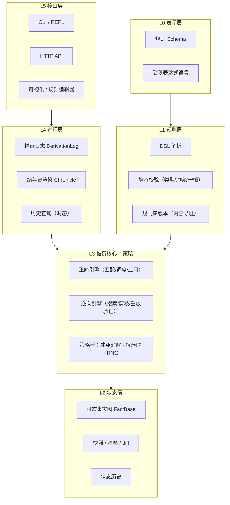
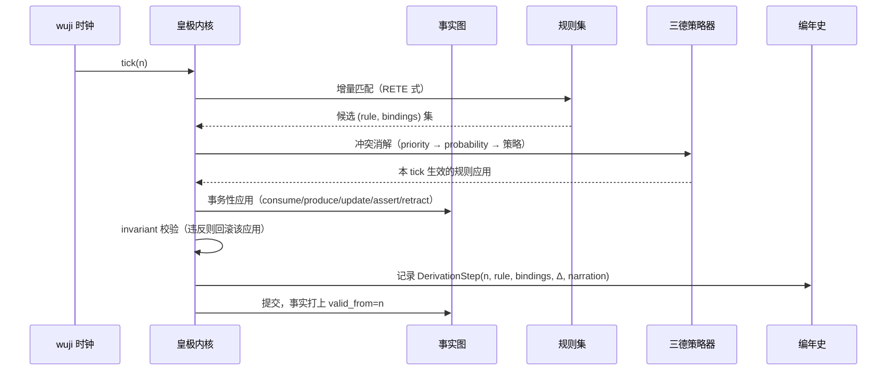
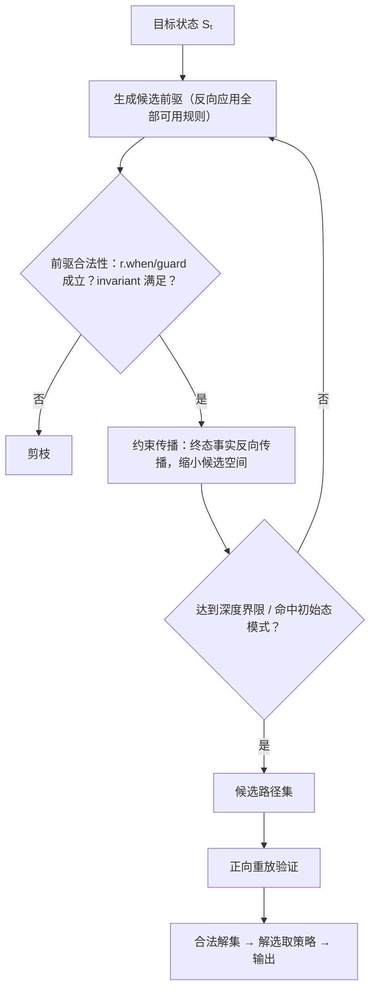

# 洪范 (Hongfan) — 世界规则引擎设计文档

| | |
|---|---|
| 版本 | v0.1（概念设计） |
| 日期 | 2026-09-08 |
| 状态 | 草案，供讨论迭代 |
| 范围 | 核心概念模型、架构分层、规则语言草案、推衍/还原机制、解选取策略、路线图 |

> 《尚书·洪范》：「天乃锡禹洪范九畴，彝伦攸叙。」
> 洪范者，天地之大法。箕子以九畴陈世界运行之规则：五行、五事、八政、五纪、皇极、三德、稽疑、庶征、五福六极。
> 本引擎以**规则为世界之大法**：万物由规则定义，演变由规则推衍，历史由规则还原。

---

## 1. 愿景与定位

### 1.1 一句话定义

洪范是一个**可编程的世界推衍引擎**：世界的一切——物质、资源、人物、行为、环境、乃至引擎与世界之间的联系——都表达为规则；引擎从初始状态出发正向推衍世界演化，也能从既定状态逆向还原出符合规则约束的演变过程，并在多解情况下按可插拔的策略选取答案。

### 1.2 它在世界构建中的位置

```
┌───────────────────────────────────────────────┐
│            应用层（由二次开发构建）                │
│   人物发展 / 行为逻辑 / 环境演变 / 经济系统 / 剧情  │
├───────────────────────────────────────────────┤
│         洪范引擎（世界之心）                     │
│   规则集管理 · 状态推衍 · 过程还原 · 解策略        │
├───────────────────────────────────────────────┤
│         表示层                                  │
│   规则 DSL · 世界状态快照 · 推衍日志 / 编年史      │
└───────────────────────────────────────────────┘
```

洪范不直接提供"人物系统""经济系统"，而是提供**生成这些系统的机制**。人物发展是行为规则的推衍结果；环境演变是演变规则的推衍结果；资源流转是转化规则的推衍结果。引擎是世界的物理法则容器与执行者——"世界之心"，与万物以联系规则相通。

### 1.3 目标与边界

**做：**

- 规则的统一表示、组合、校验与版本管理
- 世界状态（时态事实图）的存储与查询
- 正向推衍：初始状态 + 规则集 → 演化轨迹
- 逆向还原：目标状态 + 规则集 → 演变过程（可能多解）
- 解选取策略：随机 / 消耗最小 / 满足额外规则等，可插拔
- 推衍过程的记录与叙事化渲染（编年史）

**不做（v1 明确排除）：**

- 连续时间物理仿真（刚体、流体等由专门引擎负责，其结果可作为外部事件注入）
- 实时渲染与游戏循环
- GPU 并行推衍（单机单线程确定性内核优先）
- 任意宿主语言代码作为规则（表达力受限换取可分析、可逆向、可复现）

---

## 2. 核心理念

### 2.1 一切皆规则

引擎中只有一种一等公民：**规则**。传统系统中分散在不同子系统的概念，在洪范中统一为不同 `kind` 的规则：

| 传统概念 | 洪范中的规则 | kind |
|---|---|---|
| 物种/物品/资源的类型定义 | 定义规则 | `definition` |
| 物理与社会的合法性边界 | 约束规则（不变量） | `invariant` |
| 合成、冶炼、进食、折旧 | 转化规则（消耗→产出） | `transformation` |
| 人物的决策与成长 | 行为规则 | `behavior` |
| 气候、生态、文明的缓慢变迁 | 演变规则 | `evolution` |
| 实体间关系的建立与断开 | 联系规则 | `relation` |

统一的意义不是形式上的洁癖，而是**机制上的复用**：匹配、调度、推衍、还原、打分、叙事化，对所有规则共用同一套管线；定义一个新"系统"不需要改引擎，只需要写新规则。

### 2.2 世界之心：引擎与万物的联系

引擎与世界内所有实体的联系，本身也是联系规则（`relation`）。引擎视角下：

- **观察**：世界状态 = 事实图，引擎可查询任意粒度的状态
- **驱动**：规则应用改变事实图，即世界演变
- **被扰动**：外部输入（玩家操作、上位系统、真实世界数据）作为外部事件注入，视为"来自世界之外的规则触发"

引擎不隐藏在系统背后，而是世界模型中的一个显式枢纽——所有法则经由它显形，所有演变经由它发生。

### 2.3 双向推衍

```
正向（模拟）:  S₀ ──R──▶ S₁ ──R──▶ S₂ ──▶ ... ──▶ Sₜ
逆向（还原）:  Sₜ ──R⁻¹──▶ Sₜ₋₁ ──R⁻¹──▶ ... ──▶ S₀ （可能多解）
```

- **正向推衍**回答"这个.rules + 这个开端，会长成什么世界"
- **逆向还原**回答"眼前的世界状态，可能是怎样演变而来的"——给定废墟，还原文明的衰亡史；给定一位宗师，还原他的修行之路

逆向还原是洪范区别于一般规则引擎（Drools/CLIPS 只做正向）的核心能力。

### 2.4 多解与解选取策略

同一终态在规则约束下通常存在多条合法的演变路径（溯因问题的固有属性）。洪范把"选哪条解"从求解器中剥离，交给**可插拔的解选取策略（SolutionPolicy）**：

- `RandomPolicy` — 种子化随机均匀/加权采样
- `MinCostPolicy` — 全路径消耗 Σcost 最小
- `PreferencePolicy` — 满足额外软规则/偏好，逐条打分或字典序
- `DiversityPolicy` — 生成彼此差异化的多条解（供创作者挑选）
- 组合器 — 加权和、字典序、先过滤后排序

### 2.5 粒度谱系：可宏观可微观

规则携带粒度元数据（`layer`），同一现象可在不同分辨率下表达：

- 宏观："王国人口每 tick 增长 0.1%"（civilization 层）
- 微观："每个家庭在粮足且有宅时，以概率 p 生育"（household 层）

v1 支持**单层推衍**（选定一层运行，跨层互不干扰）；跨层一致性（宏观规则作为微观涌现的近似校验）列为开放问题（§11）。

---

## 3. 概念模型

### 3.1 术语表

| 术语 | 英文 | 定义 |
|---|---|---|
| 实体 | Entity | 世界中可指称的事物：物质、资源、人物、组织、地域……可抽象（"民心"）可具体（"铁锭 #42"） |
| 属性 | Property | 实体上的有类型值 |
| 联系 | Relation | 实体间的有类型边；引擎与世界的关系同样建模为联系 |
| 事实 | Fact | 某时刻成立的断言：实体存在、属性取值、联系成立 |
| 世界状态 | World State | 某时刻全体事实的集合，即一张时态属性图 |
| 规则 | Rule | 条件→效果的声明式单元，附元数据（见 3.3） |
| 规则集 | Rule Set | 不可变的规则集合，内容寻址（hash）标识版本 |
| 推衍 | Derivation | 正向：从状态 S 经规则应用到达 S′ 的计算过程 |
| 还原 | Reconstruction | 逆向：从状态反推合法演变路径（溯因） |
| 步 | Step | 一次规则应用的原子记录（绑定、增量、叙事提示） |
| 编年史 | Chronicle | 步的有序集合渲染成的可读演变史 |
| 刻 | Tick | 离散时间单位（v1 时间模型） |

### 3.2 世界状态：时态事实图

世界状态建模为**带有效时间的属性图**：

```
WorldState = Graph(
  nodes: { entity_id → (type, properties) },
  edges:   { relation_id → (type, src, dst, properties) }
)
每项数据附带 valid_from / valid_to（时态戳）
```

设计要点：

1. **图而非表**：天然表达"万物皆有联系"；联系本身可带属性（"张三 **忠于**(程度:0.8) 李四"）
2. **时态化**：状态历史 = 事实的有效期记录，天然支持"某时刻世界是什么样"的回溯查询，也是逆向还原的观测输入
3. **内容寻址快照**：状态哈希化（Merkle 风格），任何推衍结果可校验、可重放、可 diff

### 3.3 规则：统一形式与分类学

所有规则共用一个骨架，`kind` 只是元数据约定（不同 kind 走不同校验器，但共用同一执行机制）：

```yaml
rule: <唯一ID>
kind: transformation      # definition | invariant | transformation | behavior | evolution | relation
layer: civilization       # 粒度层级（自由字符串，约定优于强制）
doc: 人类可读说明
when:                     # 匹配模式：对事实图的查询，产出变量绑定
  - <pattern>...
guard:                    # 布尔约束（对绑定变量的纯表达式）
  <expr>
effects:                  # 效果：assert / retract / update / consume / produce / emit
  - <effect>...
cost: 0                   # 代价标量，供 MinCost 等策略（可省略，默认 0）
probability: 1.0          # 触发概率（可省略，默认 1）
priority: 0               # 冲突消解优先级（可省略，默认 0）
reversible: auto          # auto | true | false，逆向还原提示（见 7.6）
narration: "..."          # 叙事模板（过程生成素材，见 §8）
```

各 kind 的约定：

- **definition**：声明实体类型的属性 schema 与默认值。无 when/effects，在规则集加载期处理，构建世界的类型系统
- **invariant**：`always: <expr>`。每步推衍后校验，违反即该转移非法（正向中阻断，逆向中剪枝）
- **transformation**：when 匹配输入实体 → consume 消耗 / produce 产出，Petri 网语义保证物质守恒可校验
- **behavior**：绑定 `actor`（某类实体），描述其感知→决策→行动；执行效果仍是标准的 assert/retract/update
- **evolution**：时间驱动（每 tick / 每 N tick）的宏观变化
- **relation**：联系建立/维持/断开的条件，例如"相邻且互信 > 0.5 则建立`盟约`联系"

> 关键点：kind 影响校验与调度时段，但**不引入第二套执行机制**。统一性是引擎可逆向、可打分、可叙事化的前提。

### 3.4 推衍与还原的形式化

设规则集 R，状态空间 Σ，规则应用为偏函数：

```
apply: Σ × R × Bindings → Δ (状态增量)     满足 invariant: Σ → Bool
正向:  S_{t+1} = S_t + Δ_t,  Δ_t = apply(S_t, r_t, b_t)
逆向:  给定 S_t（及可选的部分观测 O），求 (S₀, r₁..rₜ) 使
       forward(S₀, r₁..rₜ) = S_t ∧ ∀i: invariant(Sᵢ) ∧ O ⊆ observations(S*)
       —— 这是一个约束满足/规划问题，解集通常非单点
```

---

## 4. 架构设计

### 4.1 分层架构



### 4.2 模块划分（借洪范九畴命名）

| 模块 | 取意 | 职责 |
|---|---|---|
| `wuxing` 五行 | 物质与转化 | transformation 语义、物质守恒校验 |
| `bazheng` 八政 | 行为与施为 | behavior 语义、actor 调度 |
| `shuzheng` 庶征 | 环境征候 | evolution 语义、时间驱动调度 |
| `wuji` 五纪 | 时间与历法 | tick 推进、事件时序、时态存储 |
| `huangji` 皇极 | 内核 | 推衍循环、事务性状态转移 |
| `sande` 三德 | 冲突消解 | 优先级仲裁、策略组合 |
| `jiyi` 稽疑 | 溯因还原 | 逆向搜索、解选取、重放验证 |
| `chronicle` 编年史 | （增畴） | 推衍日志→叙事渲染 |

> 命名是约定不是负担：模块的英文标识符（`wuxing` 等）稳定，中文取意写进各模块 README 首行。

### 4.3 数据流（正向推衍一 tick）



---

## 5. 规则语言（DSL 草案）

### 5.1 宿主与表达式

- **宿主格式：YAML**（人类可读可写、工具链成熟、利于 diff 与 AI 辅助编写）。JSON 是等价的机器交换格式
- **表达式语言：自研受限表达式**——纯函数、无副作用、无循环、可静态分析（类型检查 + 逆向可追溯）。这是"可逆向推衍"的前提：任意宿主代码一旦混入，逆向与复现即失效
- v2 视需要提供 S 表达式或自定义语法的紧凑写法，编译到同一中间表示（RuleIR）

### 5.2 示例集

**转化（五行）——冶炼：**

```yaml
rule: smelt-iron
kind: transformation
layer: civilization
when:
  - e1: IronOre { amount: ">= 2" }
  - e2: Coal { amount: ">= 1" }
  - w: Workshop { status: active }
guard: w.technology >= 1
consume:
  e1.amount: 2
  e2.amount: 1
produce:
  - IronIngot { amount: 1 }
  - Slag { amount: 1 }
cost: 3
narration: "{w.name} 冶出铁锭，炉火映红了夜空"
```

**行为（八政）——修行：**

```yaml
rule: practice-sword
kind: behavior
layer: person
actor: p: Person
when:
  - t: TimeSlot { type: free }
guard: p.motivation > 0.6 && p.stamina > 0.3
effects:
  - update p.swordsmanship + 0.1
  - update p.stamina - 0.2
cost: 0.5
narration: "{p.name} 挥剑千次，剑意又深了一分"
```

**演变（庶征）——降雨涨河：**

```yaml
rule: rain-fills-river
kind: evolution
layer: geography
every: 1 tick
when:
  - r: Region { weather: rainy }
  - v: River { within: r.id }
effects:
  - update v.water + rand_int(1, 3)   # 受控随机，由注入的 RNG 决定
narration: "大雨连日，{v.name} 水位上涨"
```

**联系（relation）——缔盟：**

```yaml
rule: forge-alliance
kind: relation
layer: politics
when:
  - a: Faction
  - b: Faction
  - e: Relation { type: neighbor, src: a.id, dst: b.id }
guard: trust(a, b) > 0.5 && a.threatened && b.threatened
effects:
  - assert Relation { type: alliance, src: a.id, dst: b.id, strength: 0.6 }
narration: "{a.name} 与 {b.name} 歃血为盟"
```

**约束（invariant）——物质守恒式：**

```yaml
rule: no-negative-stock
kind: invariant
always: forall e: Stocked { e.amount >= 0 }
```

### 5.3 规则集与版本管理

- 规则集 = 不可变目录结构：`ruleset://{name}@{content_hash}`
- 加载期静态校验：类型检查（against definitions）、变量绑定封闭性、transformation 守恒校验、显式规则冲突报告（同一模式+不同效果的 priority 冲突）
- 规则集可组合（import + override），override 需显式声明被覆盖的规则 ID——世界"改朝换代"（换规则集）而状态延续，是上层叙事的重要原语

---

## 6. 正向推衍引擎（皇极内核）

### 6.1 推衍循环

每 tick 三阶段（段内有序，段间固定）：

1. **演变段**（evolution 规则，时间驱动）
2. **转化段**（transformation 规则，物质流转）
3. **行为段**（behavior 规则，actor 决策）

每个应用是**事务性**的：应用→invariant 校验→违反则回滚并记录拒绝原因（供调试与逆向参考）。

### 6.2 冲突消解（三德）

同一 tick 多个候选应用竞争时，依次按：

1. `priority`（显式优先级，高者先）
2. 段序（evolution < transformation < behavior）
3. 策略器裁决（等价候选时按注入的 DecisionPolicy：随机/轮转/最优先匹配……）
4. 全部等价则按规则 ID 稳定排序（保证确定性）

### 6.3 时间模型

- v1：**离散步进（tick）**，同步推进。简单、可复现、够用
- v2 候选：事件驱动（离散事件仿真），用于稀疏活动的大世界
- `every: N ticks`、`after: event X` 作为规则触发节奏修饰

### 6.4 确定性内核与可复现性

**Run = (ruleset_hash, initial_state_hash, policy_config, seed)**

- 内核是纯函数式的：同样的输入必然产出同样的轨迹
- 一切随机性（probability、rand_*）只来自注入的种子化 RNG，策略器同样只消费该 RNG
- 任何一次推衍可凭 Run 四元组重放；编年史可 diff、可审计

> 这也是逆向还原能"正向重放验证"的基础（§7.5）。

---

## 7. 逆向还原引擎（稽疑）

### 7.1 问题定义

输入：

- 规则集 R（与正向同一套）
- 目标状态 S_t（或部分观测集 O，如"城市已成废墟""人口为 0"）
- 可选：已知的部分历史锚点（"第 3 年曾有大旱"）、步数界限 / 深度偏好

输出：满足约束的演变路径集合 `{(S₀, step₁..stepₜ)}`，按给定解选取策略排序/采样。

### 7.2 反向搜索

核心操作是**规则反向应用**：对效果 `Δ`，构造前驱状态候选——

```
reverse(S, r):  从 S 中撤销 r 的 produce/assert，恢复 r 的 consume/retract 的前提，
                产生前驱候选 S′（要求 r.when ∧ guard 在 S′ 上成立）
```

搜索框架：**反向目标回归 + 约束传播剪枝**（与经典规划器 Graphplan / SATPlan 同族）：



### 7.3 多解来源与解空间控制

多解来自：(a) 不同规则可产生同一效果（火灾与战争都能毁城）；(b) 同一规则的不同绑定（哪个城、哪一年）；(c) 不同步长与并行序。

解空间控制（否则组合爆炸）：

- **深度/步数界限**与束搜索（beam）限流
- **观测锚点**：已知的部分历史把解空间切成分段子问题
- **抽象优先**：先在宏观层还原骨架（"先有旱灾→饥荒→叛乱"），再在微观层填充细节（具体谁做了什么）——分层还原是控制复杂度的主手段
- **不可逆规则**（§7.6）阻断的分支直接剪除

### 7.4 解选取策略（可插拔 SolutionPolicy）

```rust
trait SolutionPolicy {
    // 在合法解集上做选取：排序 / 采样 / 过滤
    fn select(&self, solutions: &[Path], rng: &mut Rng) -> Vec<Path>;
}
```

| 策略 | 行为 | 典型用途 |
|---|---|---|
| `RandomPolicy { weighted_by }` | 均匀或按路径属性加权采样 | 世界多样性生成 |
| `MinCostPolicy` | Σstep.cost 最小 | 最省力的解释（奥卡姆） |
| `PreferencePolicy { rules, mode }` | 对额外软规则逐条打分（加权/字典序） | "还原一段战争史诗""主角必须是孤儿" |
| `DiversityPolicy { k }` | 距离最大化的 k 条解 | 供创作者比较挑选 |
| `Pipeline [P1, P2]` | 先过滤后排序/采样的组合器 | 复合需求 |

策略只消费注入的 RNG——选取结果同样可复现。

### 7.5 正向重放验证

反向搜索得到的是"候选路径"；由于反向应用在信息不完备时是启发的（前驱中未被效果覆盖的事实属于"自由事实"），候选必须**正向执行一遍**校验：

- 逐步应用 rule+bindings，检查 when/guard/invariant
- 终态与目标 S_t（及观测 O）一致方为合法解

这保证还原结果与正向引擎完全同构——**还原出的历史，就是一段真的可以用正向引擎重新走一遍的历史**。

### 7.6 不可逆规则

部分效果在信息论意义上不可逆（两股水混合、谣言失真）。规则可标注：

- `reversible: false` —— 逆向搜索不得跨越此规则反向应用（其覆盖的事实段视为"观测断层"）
- `reversible: auto`（默认）—— 由引擎静态分析：效果中出现的 `rand_*` 与信息汇聚点使规则自动降级为不可逆

处理方式：要求观测锚点贴邻断层两侧，或允许解中存在"史料空白"标记（编年史中渲染为"佚失"）。

---

## 8. 过程生成：推衍即编年史

### 8.1 DerivationStep

每次规则应用原子记录：

```
Step {
  tick, seq,
  rule_id, kind, layer,
  bindings: { 变量 → 实体/值 },   # 谁、在哪、对什么
  delta: Δ,                        # 状态增量（结构化）
  cost, rng_trace,                 # 消耗与随机数消耗痕迹（审计/重放）
  narration: 模板渲染上下文
}
```

正向与逆向产出**同构的 Step 序列**——"过程"在两个方向上是同一种数据。

### 8.2 叙事渲染

- 规则的 `narration` 模板 + Step 绑定 → 事件句
- 按粒度层渲染为多分辨率编年史：地理志（层：geography）、王朝世系（层：politics）、人物传（层：person）
- 编年史查询原语：`chronicle.of(entity)`、`chronicle.between(t1, t2)`、`chronicle.explain(fact)`（某事实从何而来）

`chronicle.explain` 是逆向还原的日常形态：不是整段历史重写，而是对单个事实的来历溯源。

---

## 9. 世界会话与外部干预

### 9.1 会话生命周期

```
加载规则集 → 构建初始状态（或从快照恢复）→ [推衍循环 | 还原查询] → 快照/编年史导出
```

### 9.2 开放世界：外部事件注入

外部干预（玩家、上位系统、真实数据源）建模为**外部事件规则**（`kind: external`，不可逆向，观测断层）：

```
inject(event) → 作为一步特殊应用进入事实图 → 打断/参与后续推衍
```

会话因此支持：暂停/恢复、快照分支（平行世界 = 从同一快照 + 不同策略/种子再推衍）。

---

## 10. 关键设计决策记录（ADR 摘要）

| # | 决策 | 理由 | 代价 |
|---|---|---|---|
| D1 | 世界状态 = 时态属性图（而非纯关系事实表） | 联系是一等公民（用户核心诉求）；图天然表达万物关联 | 实现复杂度高于表；时态存储需 GC 策略 |
| D2 | YAML 宿主 + 自研受限表达式，禁宿主语言代码 | 可静态分析→可类型检查、可逆向、可复现 | 表达力受限；复杂函数需走外部注册（标记不可逆） |
| D3 | 确定性纯函数内核 + 外部注入种子化 RNG | 复现、审计、重放验证、平行世界 | 一切随机须显式走 RNG，DSL 需纪律 |
| D4 | 逆向 = 反向搜索 + 约束传播 + 正向重放验证 | 反向应用不完备，重放保证与正向同构 | 双重计算；解空间大时开销加倍 |
| D5 | v1 单层推衍，layer 仅元数据 | 控制复杂度；分层还原与跨层涌现是研究方向不是 v1 承诺 | 宏观/微观同世界并用需等 v2 |
| D6 | 规则集不可变 + 内容寻址；组合靠 import/override | 世界演化可归因于明确的规则版本 | 编辑体验多一步"发布" |
| D7 | kind 是元数据约定，执行机制唯一 | 统一性是逆向/打分/叙事化的前提 | 某些 kind 的特化优化（如 RETE 对 transformation）延后 |

## 11. 风险与开放问题

| 风险/问题 | 影响 | 当前对策 |
|---|---|---|
| 逆向还原组合爆炸（NP-hard） | 大状态下还原不可行 | 深度界限 + beam + 观测锚点 + 抽象优先还原；`explain(fact)` 单点溯源作为轻量形态 |
| 规则冲突/振荡（A 产 B 毁循环） | 推衍发散 | priority + 元规则仲裁 + invariant 兜底 + 振荡检测器（报告给作者） |
| DSL 表达力与逃逸舱矛盾 | 复杂世界写不动 | 外部函数注册表（显式标记 `reversible:false`），把不可逆性显式化 |
| 大世界性能（事实图规模） | tick 延迟 | RETE 增量匹配；v2 分区/惰性区域激活 |
| 跨层一致性（宏观 vs 微观涌现） | 多分辨率世界互相矛盾 | v1 隔离；v2 研究方向：宏观作为微观的近似约束或统计校验 |
| 时态存储无限增长 | 空间膨胀 | 快照 + 增量日志；冷层归档；保留策略可配置 |
| 技术栈未定 | — | 建议：核心 Rust（性能 + 确定性 + 内容寻址友好）；DSL 工具链与编辑器 TypeScript。**待与实现节奏一起定，v0.2 决** |

## 12. 路线图

| 里程碑 | 内容 | 验收形态 |
|---|---|---|
| M1 骨架 | 概念模型落地：事实图 + 规则骨架 + 确定性推衍循环（transformation + invariant） | 命令行：给定规则集+初始态，推衍 N tick，输出编年史与终态快照 |
| M2 言语 | DSL 解析/校验/版本（L1 全通）；behavior/evolution/relation 段接入；叙事渲染 | 用 DSL 写一个 ~50 规则的样例世界（如：村落生息）完整推衍 |
| M3 稽疑 | 逆向还原：反向搜索 + 重放验证 + RandomPolicy/MinCostPolicy/PreferencePolicy | "废墟还原史"样例：多解展示 + 不同策略产出不同编年史 |
| M4 通衢 | API/REPL、快照分支（平行世界）、`chronicle.explain` | 外部程序驱动会话；单事实溯源 |
| M5 千世界 | 分层还原（抽象优先）、外部事件注入、性能加固 | 宏观骨架+微观细节的两层还原样例 |

每个里程碑都保持"可运行的世界样例"作为活文档。

---

## 附录 A：与经典系统的关系

| 经典系统 | 洪范取用 | 洪范差异 |
|---|---|---|
| 产生式系统（OPS5/CLIPS/Drools, RETE） | 匹配-消解-执行循环、增量匹配 | 增加时态图状态、粒度层、叙事输出 |
| Datalog / 逻辑程序 | 声明式规则、查询 | 洪范是状态转移系统而非纯推理；效果有副作用 |
| Petri 网 | transformation 的守恒语义 | 图状态 + 属性，不限于 token 计数 |
| 规划器（PDDL/Graphplan/SATPlan） | 逆向还原的反向搜索/回归 | 规划求"未来动作"，稽疑求"过去解释"，且解选取策略一等公民 |
| 溯因推理（Abduction） | 多解释、择优 | 显式策略接口 + 正向重放验证 |
| ECS（游戏引擎） | 实体-数据的组合观 | 联系与规则亦一等公民；推衍而非逐帧 |
| 事件演算（Event Calculus） | 时态事实的有效期观 | 作为时态存储的理论依据 |

## 附录 B：术语中英对照

洪范 / Hongfan · 世界状态 / World State · 事实图 / Fact Graph · 规则集 / Rule Set · 推衍 / Derivation · 还原 / Reconstruction · 溯因 / Abduction · 解选取策略 / SolutionPolicy · 编年史 / Chronicle · 刻 / Tick · 粒度层 / Layer · 不变量 / Invariant · 转化 / Transformation · 联系 / Relation

---

*本文档为 v0.1 概念设计。下一步：评审通过后产出 v0.2 —— 确定 §11 中的技术栈与 M1 详细设计（数据结构与接口签名）。*
