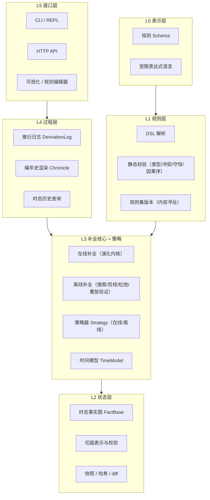
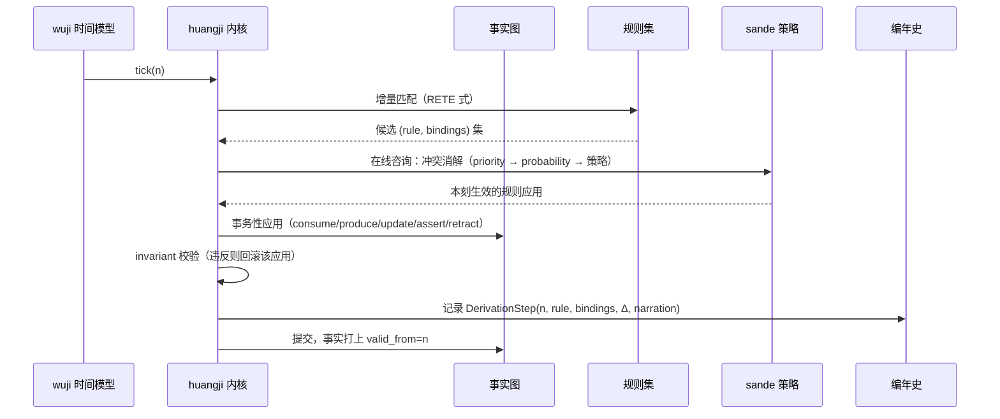
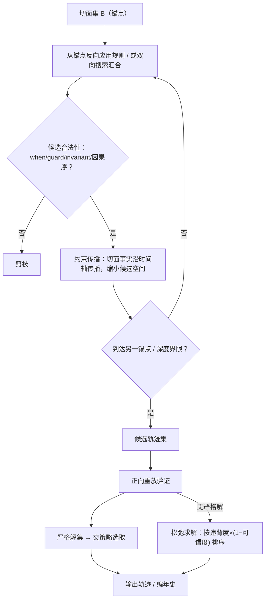

# 洪范 (Hongfan) — 世界规则引擎设计文档

| | |
|---|---|
| 版本 | v0.2（概念设计） |
| 日期 | 2026-09-08 |
| 状态 | 草案，供讨论迭代 |
| 范围 | 核心概念模型、统一补全原语、架构分层、规则语言草案、时间模型、解策略、路线图 |

> 《尚书·洪范》：「天乃锡禹洪范九畴，彝伦攸叙。」
> 洪范者，天地之大法。箕子以九畴陈世界运行之规则：五行、五事、八政、五纪、皇极、三德、稽疑、庶征、五福六极。
> 本引擎以**规则为世界之大法**：万物由规则定义，演变由规则推衍，历史由规则还原。

**版本记录**

| 版本 | 变更 |
|---|---|
| v0.1 | 初稿：概念模型、分层架构、DSL 草案、正向推衍与逆向还原 |
| v0.2 | 正向与逆向统一为**轨迹补全**原语 `complete()`；**切面**升格为一等类型（部分/带时刻/带可信度）；解空间三态（唯一解/多解/矛盾松弛）；策略接口合一（在线/离线两种咨询模式）；**时间模型接口化**，时间从背景参数变为规则化组件 |

---

## 1. 愿景与定位

### 1.1 一句话定义

洪范是一个**可编程的世界推衍引擎**：世界的一切——物质、资源、人物、行为、环境、乃至时间与引擎自身和世界之间的联系——都表达为规则；引擎沿着规则正向推衍世界演化，也能在任意**观测切面**之间补全合法的演变轨迹——还原历史、解释现状、规划未来，并在多解情况下按可插拔的策略选取答案。

### 1.2 它在世界构建中的位置

```
┌───────────────────────────────────────────────┐
│            应用层（由二次开发构建）                │
│   人物发展 / 行为逻辑 / 环境演变 / 经济系统 / 剧情  │
├───────────────────────────────────────────────┤
│         洪范引擎（世界之心）                     │
│   规则集管理 · 轨迹补全 · 解策略 · 编年史          │
├───────────────────────────────────────────────┤
│         表示层                                  │
│   规则 DSL · 观测切面 · 世界快照 · 推衍日志        │
└───────────────────────────────────────────────┘
```

洪范不直接提供"人物系统""经济系统"，而是提供**生成这些系统的机制**。人物发展是行为规则的推衍结果；环境演变是演变规则的推衍结果；资源流转是转化规则的推衍结果。引擎是世界的物理法则容器与执行者——"世界之心"，与万物以联系规则相通。

### 1.3 目标与边界

**做：**

- 规则的统一表示、组合、校验与版本管理
- 世界状态（时态事实图）与**观测切面**的表示、存储与查询
- **轨迹补全**：给定任意切面集合，补全满足规则与切面约束的演变轨迹——正向推衍（仅起点）、界间还原（两端或多锚点）、单事实溯源、目标导向规划，皆为同一原语的边界条件变体
- 解选取策略：随机 / 消耗最小 / 满足额外规则等，可插拔；在线（逐步）与离线（整路径）两种咨询模式
- 矛盾输入的松弛处理：无严格解时按违背度排序输出最优折中
- 时间模型规则化：线性离散时间为默认实现，可声明替换
- 推衍过程的记录与叙事化渲染（编年史）

**不做（v1 明确排除）：**

- 连续时间物理仿真（刚体、流体等由专门引擎负责，其结果可作为外部事件注入）
- 实时渲染与游戏循环
- GPU 并行推衍（单机单线程确定性内核优先）
- 任意宿主语言代码作为规则（表达力受限换取可分析、可逆向、可复现）
- 量子语义（振幅、干涉）——"量子化"仅作概念隐喻，见 §2.6

---

## 2. 核心理念

### 2.1 一切皆规则

引擎中只有一种一等公民：**规则**。传统系统中分散在不同子系统的概念，在洪范中统一为不同 `kind` 的规则：

| 传统概念 | 洪范中的规则 | kind |
|---|---|---|
| 物种/物品/资源的类型定义 | 定义规则 | `definition` |
| 物理与社会的合法性边界 | 约束规则（不变量） | `invariant` |
| 合成、冶炼、进食、折旧 | 转化规则（消耗→产出） | `transformation` |
| 人物的决策与成长 | 行为规则 | `behavior` |
| 气候、生态、文明的缓慢变迁 | 演变规则 | `evolution` |
| 实体间关系的建立与断开 | 联系规则 | `relation` |
| 时间如何流动 | 时间模型声明 | `time`（规则集头部声明） |

统一的意义不是形式上的洁癖，而是**机制上的复用**：匹配、调度、补全、打分、叙事化，对所有规则共用同一套管线；定义一个新"系统"不需要改引擎，只需要写新规则。

### 2.2 世界之心：引擎与万物的联系

引擎与世界内所有实体的联系，本身也是联系规则（`relation`）。引擎视角下：

- **观察**：世界状态 = 事实图，引擎可查询任意粒度的状态
- **驱动**：规则应用改变事实图，即世界演变
- **被扰动**：外部输入（玩家操作、上位系统、真实世界数据）作为外部事件注入，视为"来自世界之外的规则触发"

引擎不隐藏在系统背后，而是世界模型中的一个显式枢纽——所有法则经由它显形，所有演变经由它发生。

### 2.3 轨迹补全：推衍与还原的统一

世界在某时刻的全部可能，构成一个**轨迹集合**（合法演变路径的全体）。所谓推衍与还原，是在这个集合中**按已知边界条件补全轨迹**的同一操作：

```
complete(规则集 R, 切面集 B, 策略 P, 界限) → 轨迹（或多条轨迹 / 松弛报告）
```

切面集 B 的形态决定操作的面貌：

| 切面约束 | 操作 | 数学类比 |
|---|---|---|
| 仅起点 | **正向推衍**（演化模拟） | 条件采样 P(轨迹 \| S₀) |
| 起点 + 目标（终点开放时刻） | **目标导向规划** | 面向目标的搜索 |
| 两端，或散布多个锚点 | **界间还原 / 内插** | **布朗桥**——已知两端补中间 |
| 仅终点 | 纯溯因（从现状还原成因） | 反向条件采样 |
| 单个事实 | `chronicle.explain` 溯源 | 对单一观测的解释 |
| 零切面 | 从虚无生成世界 | 先验采样（需规则集支持"创世"） |

要点：

1. **正向也是多解的**。规则带概率、候选冲突、粒度自由度时，一个起点张开整棵可能未来之树。v0.1 把正向的逐步裁决与逆向的整体择优拆成两个接口，是伪分割——见 §8 统一策略
2. **还原与推衍同构**：都是"在轨迹集合中选取"，差别只在边界条件（固定哪些切面）与选取时机（在线逐步 / 离线整体）
3. 切面不只是逆向的剪枝手段，而是补全问题**定义的一部分**——先有观测，才有"补全"可言

### 2.4 解空间的三态：唯一、多解、矛盾

补全的结果由规则集的"完善程度"与切面约束共同决定，解空间呈三种性态：

| 性态 | 条件 | 补全行为 |
|---|---|---|
| **唯一解** | 规则完备确定，约束充分 | 补全 = 纯计算，策略不参与 |
| **多解** | 规则欠定（概率/冲突/自由度） | 补全 = 策略选取（§8） |
| **无解（矛盾）** | 规则过定，或切面彼此冲突 | 补全 = **松弛求解**：按总违背度排序，输出违背最小的轨迹及违背报告 |

第三态是第一性的能力而非异常处理：真实输入常含矛盾（两份史料各执一词、上位系统的观测与规则推衍冲突）。切面带**可信度**，松弛目标 = Σ(违背权重 × (1 − 可信度)) 最小——"各信几分"由输入声明，不由引擎裁决。

### 2.5 粒度谱系：可宏观可微观

规则携带粒度元数据（`layer`），同一现象可在不同分辨率下表达：

- 宏观："王国人口每 tick 增长 0.1%"（civilization 层）
- 微观："每个家庭在粮足且有宅时，以概率 p 生育"（household 层）

宏观规则约束不住的微观变量是**自由的**——任何策略都无权替它们定值，它们天生是轨迹之间差异的来源（§2.6 中的"测不准"）。v1 支持**单层补全**；跨层一致性与分层补全（宏观骨架先行、微观细节填充）列为路线图 M5 与开放问题（§12）。

### 2.6 量子化隐喻：词汇与边界

"把世界量子化"是理解本引擎的准确直觉，配套词汇如下：

| 隐喻 | 引擎中的实体 |
|---|---|
| 量子化 | 离散状态空间 + 离散时间；两刻之间世界**没有定义**，不是"没看到" |
| 叠加 | 补全之前，"世界" = 全体合法轨迹的集合 |
| 测量 | 提供切面：收紧轨迹集合 |
| 坍缩 | 策略选取：从集合中定出一条轨迹（加权随机策略即坍缩分布） |
| 测不准 | 粒度自由度：规则在既有分辨率下管不住的变量永远自由 |
| 退相干/佚失 | 不可逆规则造成的信息断层（§7.6），编年史渲染为"史料佚失" |

**边界（必须诚实）**：没有振幅、没有干涉，概率是经典的。严格的数学形象是**随机过程上的条件轨迹采样** P(轨迹 | 观测)——布朗桥是"已知两端补中间"的连续数学原型。本文档使用量子词汇仅为表达便利，引擎不承诺量子语义。

---

## 3. 概念模型

### 3.1 术语表

| 术语 | 英文 | 定义 |
|---|---|---|
| 实体 | Entity | 世界中可指称的事物：物质、资源、人物、组织、地域……可抽象（"民心"）可具体（"铁锭 #42"） |
| 属性 | Property | 实体上的有类型值 |
| 联系 | Relation | 实体间的有类型边；引擎与世界的关系同样建模为联系 |
| 事实 | Fact | 某时刻成立的断言：实体存在、属性取值、联系成立 |
| 世界状态 | World State | 某时刻全体事实的集合，即一张时态属性图 |
| **切面** | Slice | **对世界的一次（部分）观测**：部分事实断言 + 时刻 + 可信度。完整快照是其特例 |
| 轨迹 | Trajectory | 一次合法演变的完整记录：有序的步序列（含每步增量与时刻） |
| **补全** | Completion | 给定切面集，在轨迹集合中求满足全部约束的轨迹——引擎的统一核心原语 |
| 规则 | Rule | 条件→效果的声明式单元，附元数据（见 3.3） |
| 规则集 | Rule Set | 不可变的规则集合，内容寻址（hash）标识版本；含时间模型声明 |
| 步 | Step | 一次规则应用的原子记录（绑定、增量、叙事提示） |
| 编年史 | Chronicle | 步的有序集合渲染成的可读演变史 |
| 刻 | Tick | 离散时间单位（默认时间模型） |
| 策略 | Strategy | 在多解中做选取的可插拔组件；支持在线/离线两种咨询模式 |
| 自由度 | DoF | 规则与切面均未约束的事实维度，轨迹差异的来源 |

### 3.2 世界状态与切面

世界状态建模为**带有效时间的属性图**：

```
WorldState = Graph(
  nodes: { entity_id → (type, properties) },
  edges:   { relation_id → (type, src, dst, properties) }
)
每项数据附带 valid_from / valid_to（时态戳）
```

**切面（Slice）** 是对世界的一次观测，为一等类型：

```
Slice = {
  at:          时刻（tick 或区间）
  facts:       事实断言集（部分！只断言"这些成立"，不断言其余）
  confidence:  可信度 0..1（默认 1）
}
```

- **部分性**：切面不必是完整快照。"城市已成废墟"是一个合法切面
- **可信度**：矛盾松弛时的权重（§2.4、§7.7）
- **时序内生**：事实带有效期，"某时刻的世界"是 as-of 查询而非独立存储；切面因此天然落在时间轴上
- 完整快照 = confidence 1 的极大切面；单事实 = 最小切面（`explain` 的输入）

### 3.3 规则：统一形式与分类学

所有规则共用一个骨架，`kind` 只是元数据约定（不同 kind 走不同校验器，但共用同一执行机制）：

```yaml
rule: <唯一ID>
kind: transformation      # definition | invariant | transformation | behavior | evolution | relation
layer: civilization       # 粒度层级（自由字符串，约定优于强制）
doc: 人类可读说明
when:                     # 匹配模式：对事实图的查询，产出变量绑定
  - <pattern>...
guard:                    # 布尔约束（对绑定变量的纯表达式）
  <expr>
effects:                  # 效果：assert / retract / update / consume / produce / emit
  - <effect>...
ordering:                 # 可选：因果序声明（见 §6.4）
  precedes: <事件/规则ID>
cost: 0                   # 代价标量，供 MinCost 等策略（可省略，默认 0）
probability: 1.0          # 触发概率（可省略，默认 1）
priority: 0               # 冲突消解优先级（可省略，默认 0）
reversible: auto          # auto | true | false，补全提示（见 7.6）
narration: "..."          # 叙事模板（过程生成素材，见 §9）
```

各 kind 的约定：

- **definition**：声明实体类型的属性 schema 与默认值。无 when/effects，在规则集加载期处理，构建世界的类型系统
- **invariant**：`always: <expr>`。每步补全后校验，违反即该转移非法（在线中阻断，离线中剪枝）
- **transformation**：when 匹配输入实体 → consume 消耗 / produce 产出，Petri 网语义保证物质守恒可校验
- **behavior**：绑定 `actor`（某类实体），描述其感知→决策→行动；执行效果仍是标准的 assert/retract/update
- **evolution**：时间驱动（每 tick / 每 N tick）的宏观变化
- **relation**：联系建立/维持/断开的条件，例如"相邻且互信 > 0.5 则建立`盟约`联系"

> 关键点：kind 影响校验与调度时段，但**不引入第二套执行机制**。统一性是引擎可补全、可打分、可叙事化的前提。

### 3.4 轨迹补全的形式化

设规则集 R（含时间模型 T 与不变量集 I），轨迹 τ 为步序列，`legal(τ)` 表示每步规则应用合法且全程不变量成立，`passes(τ, B)` 表示 τ 在各切面时刻的状态与切面断言一致。补全问题：

```
complete(R, B, P, bounds):
  求 τ:  legal(τ) ∧ passes(τ, B)
  解空间三态:
    唯一解 → 返回该轨迹（计算）
    多解   → 由策略 P 选取/采样（§8）
    无解   → 松弛：argmin_τ Σ_{违背的切面断言 o} weight(o)·(1 − confidence(o))，
             返回按违背度排序的轨迹及违背报告（§7.7）
```

- 正向推衍 = B 仅含起点切面的在线补全（§6）
- 界间还原 = B 含两端（或散布锚点）的离线补全（§7）
- 补全的搜索空间 = **状态选择 × 事件选择 × 顺序选择**（当规则带因果序声明时，事件先后本身也是待补全的自由度）

---

## 4. 架构设计

### 4.1 分层架构



### 4.2 模块划分（借洪范九畴命名）

| 模块 | 取意 | 职责 |
|---|---|---|
| `wuxing` 五行 | 物质与转化 | transformation 语义、物质守恒校验 |
| `bazheng` 八政 | 行为与施为 | behavior 语义、actor 调度 |
| `shuzheng` 庶征 | 环境征候 | evolution 语义、时间驱动调度 |
| `wuji` 五纪 | 时间与历法 | **TimeModel**：tick 推进、因果序、多速率、分支；时态存储 |
| `huangji` 皇极 | 内核 | **在线补全**：匹配/调度/事务性状态转移 |
| `sande` 三德 | 裁决 | 冲突消解、策略组合与注入 |
| `jiyi` 稽疑 | 溯因求解 | **离线补全**：反向/双向搜索、松弛求解、重放验证 |
| `chronicle` 编年史 | （增畴） | 推衍日志→叙事渲染 |

> 命名是约定不是负担：模块的英文标识符（`wuxing` 等）稳定，中文取意写进各模块 README 首行。

### 4.3 数据流（在线补全推衍一刻）



---

## 5. 规则语言（DSL 草案）

### 5.1 宿主与表达式

- **宿主格式：YAML**（人类可读可写、工具链成熟、利于 diff 与 AI 辅助编写）。JSON 是等价的机器交换格式
- **表达式语言：自研受限表达式**——纯函数、无副作用、无循环、可静态分析（类型检查 + 因果序可追溯）。这是"可补全"的前提：任意宿主代码一旦混入，逆向与复现即失效
- v2 视需要提供 S 表达式或自定义语法的紧凑写法，编译到同一中间表示（RuleIR）

### 5.2 规则集头部：时间模型声明

```yaml
ruleset: my-world
version: 2026.9.8-a1f3
time:
  model: linear-tick        # linear-tick（默认）| event-driven | multi-rate | branching
  # multi-rate 示例:
  # model: multi-rate
  # rates: { civilization: 100, person: 1 }   # 文明层每 100 人物刻推进一刻
```

### 5.3 规则示例集

**转化（五行）——冶炼：**

```yaml
rule: smelt-iron
kind: transformation
layer: civilization
when:
  - e1: IronOre { amount: ">= 2" }
  - e2: Coal { amount: ">= 1" }
  - w: Workshop { status: active }
guard: w.technology >= 1
consume:
  e1.amount: 2
  e2.amount: 1
produce:
  - IronIngot { amount: 1 }
  - Slag { amount: 1 }
cost: 3
narration: "{w.name} 冶出铁锭，炉火映红了夜空"
```

**行为（八政）——修行：**

```yaml
rule: practice-sword
kind: behavior
layer: person
actor: p: Person
when:
  - t: TimeSlot { type: free }
guard: p.motivation > 0.6 && p.stamina > 0.3
effects:
  - update p.swordsmanship + 0.1
  - update p.stamina - 0.2
cost: 0.5
narration: "{p.name} 挥剑千次，剑意又深了一分"
```

**行为（八政）——夺魁（带因果序）：**

```yaml
rule: win-tournament
kind: behavior
layer: person
actor: p: Person
when:
  - exists: Tournament { open: true }
guard: p.swordsmanship > 0.8
ordering:
  precedes: practice-sword     # 夺魁必在苦练之后——因果序约束
effects:
  - update p.titles + 1
narration: "{p.name} 夺得魁首，名动一方"
```

**演变（庶征）——降雨涨河：**

```yaml
rule: rain-fills-river
kind: evolution
layer: geography
every: 1 tick
when:
  - r: Region { weather: rainy }
  - v: River { within: r.id }
effects:
  - update v.water + rand_int(1, 3)   # 受控随机，由注入的 RNG 决定
narration: "大雨连日，{v.name} 水位上涨"
```

**联系（relation）——缔盟：**

```yaml
rule: forge-alliance
kind: relation
layer: politics
when:
  - a: Faction
  - b: Faction
  - e: Relation { type: neighbor, src: a.id, dst: b.id }
guard: trust(a, b) > 0.5 && a.threatened && b.threatened
effects:
  - assert Relation { type: alliance, src: a.id, dst: b.id, strength: 0.6 }
narration: "{a.name} 与 {b.name} 歃血为盟"
```

**约束（invariant）——库存非负：**

```yaml
rule: no-negative-stock
kind: invariant
always: forall e: Stocked { e.amount >= 0 }
```

### 5.4 切面格式

补全/还原的输入，YAML 表示：

```yaml
slice:
  at: tick 1200
  confidence: 0.9          # 可信度：矛盾松弛时的权重
  facts:
    - city.status == ruins
    - city.population == 0
    - Chronicle.has("war-victory") == false   # 甚至可断言"某事未曾发生"
```

### 5.5 规则集与版本管理

- 规则集 = 不可变目录结构：`ruleset://{name}@{content_hash}`，含时间模型声明
- 加载期静态校验：类型检查（against definitions）、变量绑定封闭性、transformation 守恒校验、因果序无环、显式规则冲突报告
- 规则集可组合（import + override），override 需显式声明被覆盖的规则 ID——世界"改朝换代"（换规则集）而状态延续，是上层叙事的重要原语

---

## 6. 在线补全：正向推衍（皇极内核）

### 6.1 贪心与远视

在线补全 = 只有起点切面、边走边选：

- **贪心演化（模拟）**：每刻由策略局部裁决，推进即输出。开销 O(tick)，天然流式
- **远视演化（规划）**：B = {起点切面, 目标切面(时刻开放)}，实为离线补全的前向形态（§7 同一套搜索机制，方向向前）——"这个世界最省力地达成 X 的未来是什么"

两者是同一 Strategy 的两种咨询时机（§8），不是两种引擎。

### 6.2 每刻三阶段

1. **演变段**（evolution 规则，时间驱动）
2. **转化段**（transformation 规则，物质流转）
3. **行为段**（behavior 规则，actor 决策）

每个应用是**事务性**的：应用→invariant 校验→违反则回滚并记录拒绝原因（供调试与逆向参考）。

### 6.3 冲突消解（三德）

同刻多个候选应用竞争时，依次按：

1. `priority`（显式优先级，高者先）
2. 段序（evolution < transformation < behavior）
3. 策略在线裁决（等价候选时按注入的 Strategy：随机/轮转/最优先匹配……）
4. 全部等价则按规则 ID 稳定排序（保证确定性）

### 6.4 时间模型（五纪）：时间是规则化的组件

时间不是引擎的背景参数，而是规则集声明的组件：

```
trait TimeModel {
  推进语义:   下一刻如何产生（tick / 事件 / 多速率对齐 / 分支）
  因果序约束: precedes 声明构成的偏序，补全时必须满足
  as-of 查询: 任意时刻的世界状态视图
}
```

- **linear-tick**（默认）：全局离散刻
- **event-driven**：离散事件仿真，稀疏活动的大世界
- **multi-rate**：分层多速率——文明层一刻 = 人物层百刻，层内同步、层间按倍率对齐
- **branching**：分支时间——快照分叉为一等操作，平行世界是时间模型的表达而非外挂（§10.2）
- **因果序**：规则 `ordering.precedes` 声明构成事件偏序；离线补全时，事件**先后本身**是待求解的自由度（搜索空间含顺序选择）
- 远期（不进 v1）：局部时间（某区域时间停滞/加速）等时间玩法的规则化表达

### 6.5 确定性内核与可复现性

**Run = (ruleset_hash, initial_state_hash, strategy_config, seed)**

- 内核是纯函数式的：同样的输入必然产出同样的轨迹
- 一切随机性（probability、rand_*）只来自注入的种子化 RNG，策略器同样只消费该 RNG
- 任何一次补全可凭 Run 四元组重放；编年史可 diff、可审计

> 这也是离线补全能"正向重放验证"的基础（§7.5）。

---

## 7. 离线补全：界间还原与规划（稽疑）

### 7.1 问题定义

输入：

- 规则集 R（与正向同一套，含 TimeModel）
- 切面集 B：终点/两端/散布锚点/单事实，均可部分、可带可信度
- 可选：步数界限、深度偏好、自由度冻结声明（"微观细节暂不补全"）

输出：满足约束的轨迹集合，按给定策略排序/采样；无严格解时输出松弛最优轨迹及违背报告。

### 7.2 搜索：反向应用 + 双向汇合

核心操作是**规则反向应用**：对效果 `Δ`，构造前驱状态候选——

```
reverse(S, r):  从 S 中撤销 r 的 produce/assert，恢复 r 的 consume/retract 的前提，
                产生前驱候选 S′（要求 r.when ∧ guard 在 S′ 上成立 ∧ invariant 满足）
```



搜索空间 = **状态选择 × 事件选择 × 顺序选择**（因果序偏序的合法线性化是顺序维度的解）。

### 7.3 解空间控制（防爆炸）

多解与分支来自：(a) 不同规则可产生同一效果（火灾与战争都能毁城）；(b) 同一规则的不同绑定（哪座城、哪一年）；(c) 事件交错顺序；(d) 自由度无约束。

控制手段：

- **深度/步数界限**与束搜索（beam）限流
- **锚点切分**：多个切面把问题切成段内小问题
- **抽象优先**：先在宏观层还原骨架（"旱灾→饥荒→叛乱"），再在微观层填充细节；自由度冻结声明显式缩小搜索空间
- **不可逆规则**（§7.6）阻断的分支直接剪除

### 7.4 策略的接入

见 §8——离线补全在两个时机咨询策略：(a) 搜索中在线裁剪（beam 内排序）；(b) 解集上整体选取。

### 7.5 正向重放验证

反向应用在信息不完备时是启发的（前驱中未被效果覆盖的事实属于"自由事实"），候选必须**正向执行一遍**校验：逐步应用 rule+bindings，检查 when/guard/invariant/因果序，且轨迹在每个切面时刻与切面断言一致（按可信度）方为合法解。

这保证补全结果与在线引擎完全同构——**还原出的历史，就是一段真的可以重新走一遍的历史**。

### 7.6 不可逆规则

部分效果在信息论意义上不可逆（两股水混合、谣言失真）。规则可标注：

- `reversible: false` —— 补全不得跨越此规则反向应用（其覆盖的事实段视为"观测断层"）
- `reversible: auto`（默认）—— 由引擎静态分析：效果中出现的 `rand_*` 与信息汇聚点使规则自动降级为不可逆

处理方式：要求切面贴邻断层两侧，或允许解中存在"史料空白"标记（编年史中渲染为"佚失"）。

### 7.7 矛盾松弛

无严格解时（规则过定或切面冲突）：

```
松弛目标:  argmin_τ  Σ_{违背断言 o ∈ B} weight(o) · (1 − confidence(o))
输出:      按违背度升序的轨迹 + 结构化违背报告（哪些断言被牺牲、各自可信度）
```

典型场景：两份编年史对同一场战役的记载矛盾（各自 confidence 0.7/0.9）→ 输出偏向高可信度的轨迹，并把分歧点显式标出。松弛求解结果标记为 `degraded`，与严格解区分。

---

## 8. 策略：解的选取（三德）

### 8.1 统一接口

```rust
/// 咨询时机：在线（推衍中，每刻候选）或离线（完整轨迹集）
enum Consultation {
    Online { candidates: Vec<Candidate> },   // 一步之内：规则应用候选
    Global  { solutions: Vec<Trajectory> },  // 整体：合法轨迹集合
}

trait Strategy {
    fn decide(&mut self, c: Consultation, rng: &mut Rng) -> Decision;
}
```

- **在线模式**服务正向演化（贪心）：局部裁决，流式推进
- **离线模式**服务界间还原与远视规划：对完整路径整体择优
- 同一策略名在两种模式下各有实现（如 MinCost：在线 = 每刻选代价最小应用；离线 = 全程 Σcost 最小）

### 8.2 内置策略

| 策略 | 在线行为 | 离线行为 | 典型用途 |
|---|---|---|---|
| `RandomPolicy { weighted_by }` | 候选加权采样 | 轨迹加权采样 | 世界多样性生成 |
| `MinCostPolicy` | 每步代价最小 | Σcost 最小 | 最省力的演化/解释（奥卡姆） |
| `PreferencePolicy { rules, mode }` | 候选过滤 | 软规则打分（加权/字典序） | "还原一段战争史诗""主角必须是孤儿" |
| `DiversityPolicy { k }` | — | 距离最大化的 k 条解 | 供创作者比较挑选 |
| `Pipeline [P1, P2]` | 先过滤后采样 | 先过滤后排序 | 组合器 |

策略只消费注入的 RNG——选取结果同样可复现。

### 8.3 与解空间三态的关系

- 唯一解态：策略不参与（纯计算）
- 多解态：策略是必要输入（缺省 = 种子化随机）
- 矛盾态：松弛求解定序，策略在松弛解集上选取

---

## 9. 过程生成：推衍即编年史

### 9.1 DerivationStep

每次规则应用原子记录：

```
Step {
  tick/seq,                        # 时刻与序（因果序线性化结果）
  rule_id, kind, layer,
  bindings: { 变量 → 实体/值 },       # 谁、在哪、对什么
  delta: Δ,                            # 状态增量（结构化）
  cost, rng_trace,                     # 消耗与随机数消耗痕迹（审计/重放）
  narration: 模板渲染上下文
}
```

在线与离线产出**同构的 Step 序列**——"过程"在所有补全形态下是同一种数据。松弛解的 Step 附带 `degraded` 标记与违背报告。

### 9.2 叙事渲染

- 规则的 `narration` 模板 + Step 绑定 → 事件句
- 按粒度层渲染为多分辨率编年史：地理志（geography）、王朝世系（politics）、人物传（person）
- 编年史查询原语：`chronicle.of(entity)`、`chronicle.between(t1, t2)`、`chronicle.explain(fact)`——最后一者即"最小切面补全"的日常形态：对单个事实的来历溯源

---

## 10. 世界会话与外部干预

### 10.1 会话生命周期

```
加载规则集（含时间模型）→ 构建初始状态或载入切面/快照
  → [在线补全循环 | 离线补全查询 | explain 溯源] → 快照/编年史导出
```

### 10.2 开放世界：外部事件与平行世界

- **外部事件注入**：外部干预（玩家、上位系统、真实数据源）建模为外部事件规则（`kind: external`，不可逆，观测断层）：`inject(event) → 作为一步特殊应用进入事实图 → 参与后续补全`
- **平行世界**：快照分支（同一快照 + 不同策略/种子再补全）；在 branching 时间模型下升格为一等结构——世界树

会话因此支持：暂停/恢复、分支、切面注入触发的增量补全（"史官补记一段新出土的史料"）。

---

## 11. 关键设计决策记录（ADR 摘要）

| # | 决策 | 理由 | 代价 |
|---|---|---|---|
| D1 | 世界状态 = 时态属性图（而非纯关系事实表） | 联系是一等公民；图天然表达万物关联 | 实现复杂度高于表；时态存储需 GC 策略 |
| D2 | YAML 宿主 + 自研受限表达式，禁宿主语言代码 | 可静态分析→可类型检查、可补全、可复现 | 表达力受限；复杂函数走外部注册（标记不可逆） |
| D3 | 确定性纯函数内核 + 外部注入种子化 RNG | 复现、审计、重放验证、平行世界 | 一切随机须显式走 RNG，DSL 需纪律 |
| D4 | **正反统一为补全原语 complete()**；推衍/还原/规划/explain 皆为其边界条件变体 | 正向亦多解；两方向共享轨迹集合、验证与策略机制 | 接口需同时容纳在线/离线两种咨询；实现层仍分在线/离线两执行器 |
| D5 | v1 单层补全，layer 仅元数据 | 控制复杂度；分层还原与跨层涌现是研究方向不是 v1 承诺 | 宏观/微观同世界并用需等 v2+ |
| D6 | 规则集不可变 + 内容寻址；组合靠 import/override | 世界演化可归因于明确的规则版本 | 编辑体验多一步"发布" |
| D7 | kind 是元数据约定，执行机制唯一 | 统一性是补全/打分/叙事化的前提 | 某些 kind 的特化优化延后 |
| D8 | **切面为一等类型**：部分事实 + 时刻 + 可信度 | 观测本就部分且可错；矛盾松弛需要可信度权重 | 完整快照退化为特例，接口须区分"断言成立"与"未断言" |
| D9 | **解空间三态**，矛盾走松弛而非报错了事 | 真实输入常含矛盾；"最接近的解释"本身有价值 | 松弛是优化问题，复杂度高；结果须标记 degraded |
| D10 | **时间模型接口化**，tick 仅为默认实现；因果序为声明式约束 | 时间是世界组件不是背景参数；顺序本身可以是待补全的自由度 | 多速率/分支时间模型的存储与查询复杂化 |

## 12. 风险与开放问题

| 风险/问题 | 影响 | 当前对策 |
|---|---|---|
| 离线补全组合爆炸（NP-hard，且含顺序维度） | 大状态下还原不可行 | 深度界限 + beam + 锚点切分 + 抽象优先 + 自由度冻结；`explain(fact)` 单点溯源作为轻量形态 |
| 松弛求解复杂度（本身是加权优化问题） | 矛盾输入下耗时不可控 | 限界松弛（只松弛低可信度断言）、贪心近似、结果标记 degraded |
| 规则冲突/振荡（A 产 B 毁循环） | 推衍发散 | priority + 元规则仲裁 + invariant 兜底 + 振荡检测器 |
| DSL 表达力与逃逸舱矛盾 | 复杂世界写不动 | 外部函数注册表（显式 `reversible:false`），把不可逆性显式化 |
| 大世界性能（事实图规模） | tick 延迟 | RETE 增量匹配；v2 分区/惰性区域激活 |
| 跨层一致性（宏观 vs 微观涌现） | 多分辨率世界互相矛盾 | v1 隔离；研究方向：宏观作为微观的近似约束或统计校验 |
| 时态存储无限增长 | 空间膨胀 | 快照 + 增量日志；冷层归档；保留策略可配置 |
| 多速率/分支时间的查询语义 | as-of 查询在分支/层间变得复杂 | v1 只实现 linear-tick；其余模型先定接口语义再实现 |
| 技术栈未定 | — | 建议：核心 Rust（性能 + 确定性 + 内容寻址友好）；DSL 工具链与编辑器 TypeScript。**v0.3 决** |

## 13. 路线图

| 里程碑 | 内容 | 验收形态 |
|---|---|---|
| M1 骨架 | 概念模型落地：事实图 + 切面 + 轨迹/Step + 确定性在线补全（transformation + invariant），complete() 接口签名自始就位 | 命令行：给定规则集+初始态，推衍 N 刻，输出编年史与终态快照 |
| M2 言语 | DSL 解析/校验/版本（L1 全通）；behavior/evolution/relation 段接入；时间模型声明化（linear-tick）；叙事渲染 | 用 DSL 写 ~50 规则的样例世界（村落生息）完整推衍 |
| M3 稽疑 | 离线补全：反向搜索 + 重放验证 + 策略族（在线/离线）+ 矛盾松弛 | "废墟还原史"样例：多解展示、不同策略产出不同编年史、矛盾史料松弛还原 |
| M4 通衢 | API/REPL、快照分支、`chronicle.explain`、切面注入增量补全 | 外部程序驱动会话；单事实溯源 |
| M5 千世界 | TimeModel 变体（multi-rate / branching 平行世界树）、分层补全（抽象优先）、外部事件注入、性能加固 | 宏观骨架+微观细节的两层还原样例；分支世界对比 |

每个里程碑都保持"可运行的世界样例"作为活文档。

---

## 附录 A：与经典系统的关系

| 经典系统 | 洪范取用 | 洪范差异 |
|---|---|---|
| 产生式系统（OPS5/CLIPS/Drools, RETE） | 匹配-消解-执行循环、增量匹配 | 增加时态图状态、粒度层、切面补全、叙事输出 |
| Datalog / 逻辑程序 | 声明式规则、查询 | 洪范是状态转移系统而非纯推理；效果有副作用 |
| Petri 网 | transformation 的守恒语义 | 图状态 + 属性，不限于 token 计数 |
| 规划器（PDDL/Graphplan/SATPlan） | 反向搜索、目标回归 | 规划只是 complete() 的前向边界形态；切面/可信度/松弛是一般化 |
| 溯因推理（Abduction） | 多解释、择优 | 显式策略接口 + 正向重放验证 + 矛盾松弛 |
| 随机过程 / 条件轨迹采样 / 布朗桥 | complete() 的数学原型：P(轨迹\|观测) | 离散、规则驱动、可叙事 |
| 离散事件仿真（DES） | event-driven 时间模型 | 时间模型可换，tick 为默认 |
| ECS（游戏引擎） | 实体-数据的组合观 | 联系与规则亦一等公民；补全而非逐帧 |
| 事件演算（Event Calculus） | 时态事实的有效期观 | 作为时态存储的理论依据 |

## 附录 B：术语中英对照

洪范 / Hongfan · 世界状态 / World State · 事实图 / Fact Graph · 切面 / Slice · 轨迹 / Trajectory · 补全 / Completion · 规则集 / Rule Set · 策略 / Strategy · 时间模型 / TimeModel · 因果序 / Causal Ordering · 编年史 / Chronicle · 刻 / Tick · 粒度层 / Layer · 自由度 / Degree of Freedom · 不变量 / Invariant · 转化 / Transformation · 联系 / Relation · 松弛 / Relaxation · 可信度 / Confidence

---

*本文档为 v0.2 概念设计。下一步：评审通过后产出 v0.3 —— 确定 §12 中的技术栈与 M1 详细设计（complete() 及核心数据结构的接口签名、切面匹配语义）。*
