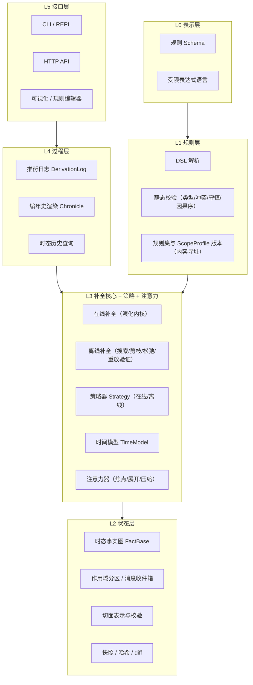
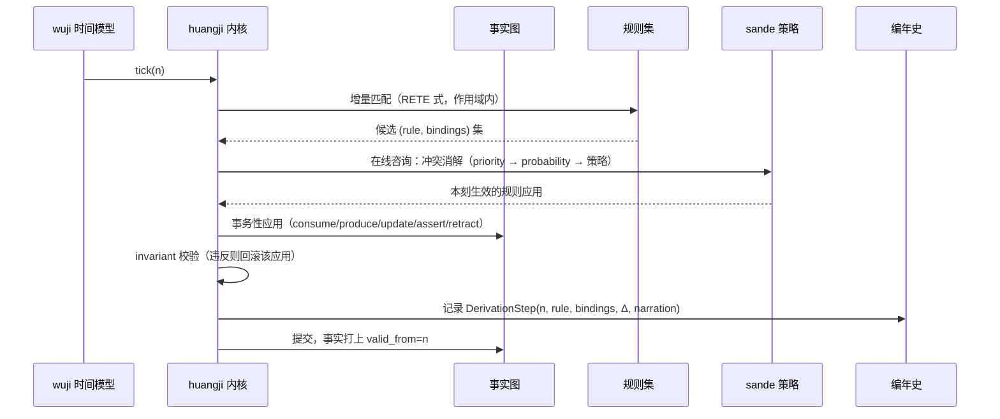
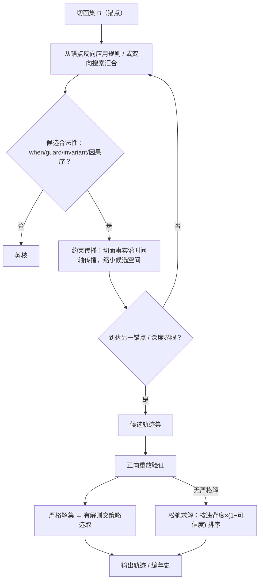

# 洪范 (Hongfan) — 世界规则引擎设计文档

| | |
|---|---|
| 版本 | v0.4（概念设计） |
| 日期 | 2026-09-11 |
| 状态 | 草案，供讨论迭代 |
| 范围 | 核心概念模型、统一补全原语、作用域与注意力、个体规则、观测落盘与世界线、求解器层、架构分层、规则语言草案、时间模型、解策略、路线图 |

> 《尚书·洪范》：「天乃锡禹洪范九畴，彝伦攸叙。」
> 洪范者，天地之大法。箕子以九畴陈世界运行之规则：五行、五事、八政、五纪、皇极、三德、稽疑、庶征、五福六极。
> 本引擎以**规则为世界之大法**：万物由规则定义，演变由规则推衍，历史由规则还原。

**版本记录**

| 版本 | 变更 |
|---|---|
| v0.1 | 初稿：概念模型、分层架构、DSL 草案、正向推衍与逆向还原 |
| v0.2 | 正向与逆向统一为**轨迹补全**原语 `complete()`；**切面**升格为一等类型（部分/带时刻/带可信度）；解空间三态（唯一解/多解/矛盾松弛）；策略接口合一（在线/离线两种咨询模式）；**时间模型接口化**，时间从背景参数变为规则化组件 |
| v0.3 | 新增三大一等概念：**作用域**（世界分区/局部推衍/分区并行与消息定序/惰性时间跳步/规则集组合寻址）、**个体规则**（规则即数据/可生成/时态化）、**注意力**（展开-压缩对偶/信息不完备/延迟还原与叠加保持）；新 ADR D11–D14；路线图 M5 拆分为 M5/M6/M7；M1 标记已完成 |
| v0.4 | **观测落盘与世界线绑定**（§10.6：坍缩即写入史册层、重观测幂等、翻案走松弛、单线/fork(k) 多元观测）；**求解器层**（§7.8：提案-验证分离的三层正交——规则/求解器/策略，代价模型扩展至转移代价与轨迹泛函）；新 ADR-0018/0019 |

---

## 1. 愿景与定位

### 1.1 一句话定义

洪范是一个**可编程的世界推衍引擎**：世界的一切——物质、资源、人物、行为、环境、乃至时间与引擎自身和世界之间的联系——都表达为规则；引擎沿着规则正向推衍世界演化，也能在任意**观测切面**之间补全合法的演变轨迹——还原历史、解释现状、规划未来，并在多解情况下按可插拔的策略选取答案。世界不必整体推衍：它在**作用域**中分区运行，随**注意力**展开或压缩。

### 1.2 它在世界构建中的位置

```
┌───────────────────────────────────────────────┐
│            应用层（由二次开发构建）                │
│   人物发展 / 行为逻辑 / 环境演变 / 经济系统 / 剧情  │
├───────────────────────────────────────────────┤
│         洪范引擎（世界之心）                     │
│   规则集管理 · 轨迹补全 · 作用域 · 注意力          │
│   解策略 · 编年史                                │
├───────────────────────────────────────────────┤
│         表示层                                  │
│   规则 DSL · 观测切面 · 世界快照 · 推衍日志        │
└───────────────────────────────────────────────┘
```

洪范不直接提供"人物系统""经济系统"，而是提供**生成这些系统的机制**。人物发展是行为规则的推衍结果；环境演变是演变规则的推衍结果；资源流转是转化规则的推衍结果。引擎是世界的物理法则容器与执行者——"世界之心"，与万物以联系规则相通。

### 1.3 目标与边界

**做：**

- 规则的统一表示、组合、校验与版本管理
- 世界状态（时态事实图）与**观测切面**的表示、存储与查询
- **轨迹补全**：给定任意切面集合，补全满足规则与切面约束的演变轨迹——正向推衍（仅起点）、界间还原（两端或多锚点）、单事实溯源、目标导向规划，皆为同一原语的边界条件变体
- 解选取策略：随机 / 消耗最小 / 满足额外规则等，可插拔；在线（逐步）与离线（整路径）两种咨询模式
- 矛盾输入的松弛处理：无严格解时按违背度排序输出最优折中
- 时间模型规则化：线性离散时间为默认实现，可声明替换
- **作用域化推衍**（v0.3）：世界分区、局部推衍、跨作用域消息（因果偏序）、分区并行的确定性
- **个体规则**（v0.3）：实体级规则分片，可生成、可时变
- **注意力机制**（v0.3）：展开/压缩、焦点调度、延迟还原与叠加保持
- 推衍过程的记录与叙事化渲染（编年史）

**不做（v1 明确排除）：**

- 连续时间物理仿真（刚体、流体等由专门引擎负责，其结果可作为外部事件注入）
- 实时渲染与游戏循环
- GPU 并行推衍（分区并行优先，单区单线程确定性内核）
- 任意宿主语言代码作为规则（表达力受限换取可分析、可逆向、可复现）
- 量子语义（振幅、干涉）——"量子化"仅作概念隐喻，见 §2.6

---

## 2. 核心理念

### 2.1 一切皆规则

引擎中只有一种一等公民：**规则**。传统系统中分散在不同子系统的概念，在洪范中统一为不同 `kind` 的规则：

| 传统概念 | 洪范中的规则 | kind |
|---|---|---|
| 物种/物品/资源的类型定义 | 定义规则 | `definition` |
| 物理与社会的合法性边界 | 约束规则（不变量） | `invariant` |
| 合成、冶炼、进食、折旧 | 转化规则（消耗→产出） | `transformation` |
| 人物的决策与成长 | 行为规则 | `behavior` |
| 气候、生态、文明的缓慢变迁 | 演变规则 | `evolution` |
| 实体间关系的建立与断开 | 联系规则 | `relation` |
| 时间如何流动 | 时间模型声明 | `time`（规则集头部声明） |

统一的意义不是形式上的洁癖，而是**机制上的复用**：匹配、调度、补全、打分、叙事化，对所有规则共用同一套管线；定义一个新"系统"不需要改引擎，只需要写新规则。

v0.3 把这条原则贯彻到个体：规则不但描述类，也可以**作为数据附加在个体身上**（性格分片，§9）——规则既是推衍的依据，也是世界状态的一部分。

### 2.2 世界之心：引擎与万物的联系

引擎与世界内所有实体的联系，本身也是联系规则（`relation`）。引擎视角下：

- **观察**：世界状态 = 事实图，引擎可查询任意粒度的状态
- **驱动**：规则应用改变事实图，即世界演变
- **被扰动**：外部输入（玩家操作、上位系统、真实世界数据）作为外部事件注入，视为"来自世界之外的规则触发"

引擎不隐藏在系统背后，而是世界模型中的一个显式枢纽——所有法则经由它显形，所有演变经由它发生。v0.3 补上最后一笔：**引擎自身不观视世界**——看哪里、看多细，由注意力决定，而注意力来自世界之外（§10.4）。

### 2.3 轨迹补全：推衍与还原的统一

世界在某时刻的全部可能，构成一个**轨迹集合**（合法演变路径的全体）。所谓推衍与还原，是在这个集合中**按已知边界条件补全轨迹**的同一操作：

```
complete(规则集 R, 切面集 B, 策略 P, 界限) → 轨迹（或多条轨迹 / 松弛报告）
```

切面集 B 的形态决定操作的面貌：

| 切面约束 | 操作 | 数学类比 |
|---|---|---|
| 仅起点 | **正向推衍**（演化模拟） | 条件采样 P(轨迹 \| S₀) |
| 起点 + 目标（终点开放时刻） | **目标导向规划** | 面向目标的搜索 |
| 两端，或散布多个锚点 | **界间还原 / 内插** | **布朗桥**——已知两端补中间 |
| 仅终点 | 纯溯因（从现状还原成因） | 反向条件采样 |
| 单个事实 | `chronicle.explain` 溯源 | 对单一观测的解释 |
| 零切面 | 从虚无生成世界 | 先验采样（需规则集支持"创世"） |

要点：

1. **正向也是多解的**。规则带概率、候选冲突、粒度自由度时，一个起点张开整棵可能未来之树。v0.1 把正向的逐步裁决与逆向的整体择优拆成两个接口，是伪分割——见 §11 统一策略
2. **还原与推衍同构**：都是"在轨迹集合中选取"，差别只在边界条件（固定哪些切面）与选取时机（在线逐步 / 离线整体）
3. 切面不只是逆向的剪枝手段，而是补全问题**定义的一部分**——先有观测，才有"补全"可言
4. v0.3：补全原语**作用域化**——`complete(scope, …)` 在作用域的规则视图与实体子集内进行（§8.2）

### 2.4 解空间的三态：唯一、多解、矛盾

补全的结果由规则集的"完善程度"与切面约束共同决定，解空间呈三种性态：

| 性态 | 条件 | 补全行为 |
|---|---|---|
| **唯一解** | 规则完备确定，约束充分 | 补全 = 纯计算，策略不参与 |
| **多解** | 规则欠定（概率/冲突/自由度） | 补全 = 策略选取（§11） |
| **无解（矛盾）** | 规则过定，或切面彼此冲突 | 补全 = **松弛求解**：按总违背度排序，输出违背最小的轨迹及违背报告 |

第三态是第一性的能力而非异常处理：真实输入常含矛盾（两份史料各执一词、上位系统的观测与规则推衍冲突）。切面带**可信度**，松弛目标 = Σ(违背权重 × (1 − 可信度)) 最小——"各信几分"由输入声明，不由引擎裁决。

v0.3 补充：注意力离开造成的**有损压缩**（§10.1）让"欠定"成为常态——被压缩掉的细节以多解自由度的形式回归，这正是还原时"解释空间"的来源。

### 2.5 粒度谱系：可宏观可微观

规则携带粒度元数据（`layer`），同一现象可在不同分辨率下表达：

- 宏观："王国人口每 tick 增长 0.1%"（civilization 层）
- 微观："每个家庭在粮足且有宅时，以概率 p 生育"（household 层）

宏观规则约束不住的微观变量是**自由的**——任何策略都无权替它们定值，它们天生是轨迹之间差异的来源（§2.6 中的"测不准"）。v0.3 起层与作用域合流：分层的世界结构由**作用域树**承载（§8），各层的展开粒度由**注意力**决定（§10）。

### 2.6 量子化隐喻：词汇与边界

"把世界量子化"是理解本引擎的准确直觉，配套词汇如下：

| 隐喻 | 引擎中的实体 |
|---|---|
| 量子化 | 离散状态空间 + 离散时间；两刻之间世界**没有定义**，不是"没看到" |
| 叠加 | 补全之前，"世界" = 全体合法轨迹的集合 |
| 测量 | 提供切面：收紧轨迹集合 |
| 坍缩 | 策略选取：从集合中定出一条轨迹（加权随机策略即坍缩分布） |
| 测不准 | 粒度自由度：规则在既有分辨率下管不住的变量永远自由 |
| 退相干/佚失 | 不可逆规则与有损压缩造成的信息断层，编年史渲染为"史料佚失" |
| 无全局同时性 | v0.3：各作用域有自己的局部时钟，跨作用域只有因果序（消息定序）——相对论式世界 |
| 多世界诠释 | v0.4：单线观测重看同一世界（史册层幂等）；fork(k) 一次观测分叉 k 条世界线，各线独立坍缩落盘（§10.6） |

**边界（必须诚实）**：没有振幅、没有干涉，概率是经典的。严格的数学形象是**随机过程上的条件轨迹采样** P(轨迹 | 观测)——布朗桥是"已知两端补中间"的连续数学原型。本文档使用量子词汇仅为表达便利，引擎不承诺量子语义。

---

## 3. 概念模型

### 3.1 术语表

| 术语 | 英文 | 定义 |
|---|---|---|
| 实体 | Entity | 世界中可指称的事物：物质、资源、人物、组织、地域……可抽象（"民心"）可具体（"铁锭 #42"） |
| 属性 | Property | 实体上的有类型值 |
| 联系 | Relation | 实体间的有类型边；引擎与世界的关系同样建模为联系 |
| 事实 | Fact | 某时刻成立的断言：实体存在、属性取值、联系成立 |
| 世界状态 | World State | 某时刻全体事实的集合，即一张时态属性图 |
| **切面** | Slice | **对世界的一次（部分）观测**：部分事实断言 + 时刻 + 可信度。完整快照是其特例 |
| 轨迹 | Trajectory | 一次合法演变的完整记录：有序的步序列（含每步增量与时刻） |
| **补全** | Completion | 给定切面集，在轨迹集合中求满足全部约束的轨迹——引擎的统一核心原语 |
| **作用域** | Scope | 世界状态的一级分区：实体/关系子集 + 规则视图 + 局部时钟 + 消息收件箱；作用域构成树/图（§8） |
| **规则视图** | ScopeProfile | 作用域实际生效的规则集 = 类规则包的组合 ∪ 个体分片；内容寻址的组合描述（§8.6） |
| **个体规则** | Instance Rule | 附加于实体个体的规则分片（如性格）；可生成、可时变（§9） |
| **消息** | Message | 跨作用域投递的切面：部分事实 + 可信度 + 发送方局部时刻（§8.3） |
| **注意力** | Attention | 引擎的资源分配策略：各作用域的推衍粒度与频率；进入=展开，离开=压缩（§10） |
| 规则 | Rule | 条件→效果的声明式单元，附元数据（见 3.3） |
| 规则集 | Rule Set | 不可变的规则集合，内容寻址（hash）标识版本；含时间模型声明 |
| 步 | Step | 一次规则应用的原子记录（绑定、增量、叙事提示） |
| 编年史 | Chronicle | 步的有序集合渲染成的可读演变史 |
| 刻 | Tick | 离散时间单位（默认时间模型） |
| 策略 | Strategy | 在多解中做选取的可插拔组件；支持在线/离线两种咨询模式 |
| 自由度 | DoF | 规则与切面均未约束的事实维度，轨迹差异的来源 |
| 展开/压缩 | Expand / Condense | 注意力的对偶操作：细节推衍 ↔ 粗粒度投影（有损）（§10.1） |
| **史册层** | Annals | 既定事实全集（含观测落盘的 derived 事实）；压缩只作用于工作态、不焚毁史册；翻案走松弛（§10.6） |
| **世界线** | Worldline | 注意力的绑定对象：bound（默认，重观测幂等）或 fork(k)（一次观测分叉 k 条世界线）（§10.6） |
| **求解器** | Solver | 补全的方法层：`propose → 候选轨迹集` 的可插拔纯函数；只提案，出口统一正向重放验证（§7.8） |

### 3.2 世界状态与切面

世界状态建模为**带有效时间的属性图**：

```
WorldState = Graph(
  nodes: { entity_id → (type, properties) },
  edges:   { relation_id → (type, src, dst, properties) }
)
每项数据附带 valid_from / valid_to（时态戳）
```

**切面（Slice）** 是对世界的一次观测，为一等类型：

```
Slice = {
  at:          时刻（tick 或区间）
  facts:       事实断言集（部分！只断言"这些成立"，不断言其余）
  confidence:  可信度 0..1（默认 1）
}
```

- **部分性**：切面不必是完整快照。"城市已成废墟"是一个合法切面
- **可信度**：矛盾松弛时的权重（§2.4、§7.7）
- **时序内生**：事实带有效期，"某时刻的世界"是 as-of 查询而非独立存储；切面因此天然落在时间轴上
- 完整快照 = confidence 1 的极大切面；单事实 = 最小切面（`explain` 的输入）
- v0.3：作用域之间的**消息**就是跨边界投递的切面（§10.2）

### 3.3 规则：统一形式与分类学

所有规则共用一个骨架，`kind` 只是元数据约定（不同 kind 走不同校验器，但共用同一执行机制）：

```yaml
rule: <唯一ID>
kind: transformation      # definition | invariant | transformation | behavior | evolution | relation
layer: civilization       # 粒度层级（自由字符串，约定优于强制）
doc: 人类可读说明
when:                     # 匹配模式：对事实图的查询，产出变量绑定
  - <pattern>...
guard:                    # 布尔约束（对绑定变量的纯表达式）
  <expr>
effects:                  # 效果：assert / retract / update / consume / produce / emit
  - <effect>...
ordering:                 # 可选：因果序声明（见 §6.4）
  precedes: <事件/规则ID>
cost: 0                   # 代价标量，供 MinCost 等策略（可省略，默认 0）
probability: 1.0          # 触发概率（可省略，默认 1）
priority: 0               # 冲突消解优先级（可省略，默认 0）
reversible: auto          # auto | true | false，补全提示（见 7.6）
narration: "..."          # 叙事模板（过程生成素材，见 §12）
```

各 kind 的约定：

- **definition**：声明实体类型的属性 schema 与默认值。无 when/effects，在规则集加载期处理，构建世界的类型系统
- **invariant**：`always: <expr>`。每步补全后校验，违反即该转移非法（在线中阻断，离线中剪枝）
- **transformation**：when 匹配输入实体 → consume 消耗 / produce 产出，Petri 网语义保证物质守恒可校验
- **behavior**：绑定 `actor`（某类实体），描述其感知→决策→行动；执行效果仍是标准的 assert/retract/update
- **evolution**：时间驱动（每 tick / 每 N tick）的宏观变化
- **relation**：联系建立/维持/断开的条件，例如"相邻且互信 > 0.5 则建立`盟约`联系"

> 关键点：kind 影响校验与调度时段，但**不引入第二套执行机制**。统一性是引擎可补全、可打分、可叙事化的前提。v0.3 起个体规则分片复用同一骨架（§9）。

### 3.4 轨迹补全的形式化

设规则集 R（含时间模型 T 与不变量集 I），轨迹 τ 为步序列，`legal(τ)` 表示每步规则应用合法且全程不变量成立，`passes(τ, B)` 表示 τ 在各切面时刻的状态与切面断言一致。补全问题：

```
complete(R, B, P, bounds):
  求 τ:  legal(τ) ∧ passes(τ, B)
  解空间三态:
    唯一解 → 返回该轨迹（计算）
    多解   → 由策略 P 选取/采样（§11）
    无解   → 松弛：argmin_τ Σ_{违背的切面断言 o} weight(o)·(1 − confidence(o))，
             返回按违背度排序的轨迹及违背报告（§7.7）
```

- 正向推衍 = B 仅含起点切面的在线补全（§6）
- 界间还原 = B 含两端（或散布锚点）的离线补全（§7）
- 补全的搜索空间 = **状态选择 × 事件选择 × 顺序选择**（当规则带因果序声明时，事件先后本身也是待补全的自由度）
- v0.3：补全在作用域内进行——`complete(scope, B, P, bounds)`，R 取该作用域的 ScopeProfile（§8.2）

---

## 4. 架构设计

### 4.1 分层架构



### 4.2 模块划分（借洪范九畴命名）

| 模块 | 取意 | 职责 |
|---|---|---|
| `wuxing` 五行 | 物质与转化 | transformation 语义、物质守恒校验 |
| `bazheng` 八政 | 行为与施为 | behavior 语义、actor 调度 |
| `shuzheng` 庶征 | 环境征候 | evolution 语义、时间驱动调度 |
| `wuji` 五纪 | 时间与历法 | TimeModel：tick/事件/多速率/分支；**作用域局部时钟与消息时刻、惰性跳步**（§8.5） |
| `wushi` 五事 | 观与注视 | **注意力**：焦点调度、展开/压缩、背景作用域惰性推进（§10） |
| `huangji` 皇极 | 内核 | **在线补全**：匹配/调度/事务性状态转移；**作用域编排**（并行单元管理） |
| `sande` 三德 | 裁决 | 冲突消解、策略组合与注入 |
| `jiyi` 稽疑 | 溯因求解 | **离线补全**：反向/双向搜索、松弛求解、重放验证；压缩切面的延迟还原（§10.3） |
| `chronicle` 编年史 | （增畴） | 推衍日志→叙事渲染 |

> 命名是约定不是负担：模块的英文标识符（`wuxing` 等）稳定，中文取意写进各模块 README 首行。五事（貌言视听思）取"感知与注视"之意，对应注意力。

### 4.3 数据流（在线补全推衍一刻，单作用域视角）



---

## 5. 规则语言（DSL 草案）

### 5.1 宿主与表达式

- **宿主格式：YAML**（人类可读可写、工具链成熟、利于 diff）。JSON 是等价的机器交换格式
- **表达式语言：自研受限表达式**——纯函数、无副作用、无循环、可静态分析（类型检查 + 因果序可追溯）。这是"可补全"的前提：任意宿主代码一旦混入，逆向与复现即失效
- v2 视需要提供 S 表达式或自定义语法的紧凑写法，编译到同一中间表示（RuleIR）

### 5.2 规则集头部：时间模型声明

```yaml
ruleset: my-world
version: 2026.9.11-a1f3
time:
  model: linear-tick        # linear-tick（默认）| event-driven | multi-rate | branching
  # multi-rate 示例:
  # model: multi-rate
  # rates: { civilization: 100, person: 1 }   # 文明层每 100 人物刻推进一刻
```

### 5.3 规则示例集

**转化（五行）——冶炼：**

```yaml
rule: smelt-iron
kind: transformation
layer: civilization
when:
  - e1: IronOre { amount: ">= 2" }
  - e2: Coal { amount: ">= 1" }
  - w: Workshop { status: active }
guard: w.technology >= 1
consume:
  e1.amount: 2
  e2.amount: 1
produce:
  - IronIngot { amount: 1 }
  - Slag { amount: 1 }
cost: 3
narration: "{w.name} 冶出铁锭，炉火映红了夜空"
```

**行为（八政）——修行：**

```yaml
rule: practice-sword
kind: behavior
layer: person
actor: p: Person
when:
  - t: TimeSlot { type: free }
guard: p.motivation > 0.6 && p.stamina > 0.3
effects:
  - update p.swordsmanship + 0.1
  - update p.stamina - 0.2
cost: 0.5
narration: "{p.name} 挥剑千次，剑意又深了一分"
```

**演变（庶征）——降雨涨河：**

```yaml
rule: rain-fills-river
kind: evolution
layer: geography
every: 1 tick
when:
  - r: Region { weather: rainy }
  - v: River { within: r.id }
effects:
  - update v.water + rand_int(1, 3)   # 受控随机，由注入的 RNG 决定
narration: "大雨连日，{v.name} 水位上涨"
```

**联系（relation）——缔盟：**

```yaml
rule: forge-alliance
kind: relation
layer: politics
when:
  - a: Faction
  - b: Faction
  - e: Relation { type: neighbor, src: a.id, dst: b.id }
guard: trust(a, b) > 0.5 && a.threatened && b.threatened
effects:
  - assert Relation { type: alliance, src: a.id, dst: b.id, strength: 0.6 }
narration: "{a.name} 与 {b.name} 歃血为盟"
```

**约束（invariant）——库存非负：**

```yaml
rule: no-negative-stock
kind: invariant
always: forall e: Stocked { e.amount >= 0 }
```

### 5.4 切面格式

补全/还原的输入，YAML 表示：

```yaml
slice:
  at: tick 1200
  confidence: 0.9          # 可信度：矛盾松弛时的权重
  facts:
    - city.status == ruins
    - city.population == 0
    - Chronicle.has("war-victory") == false   # 甚至可断言"某事未曾发生"
```

### 5.5 作用域与个体规则（v0.3 草案，非 M1 语法）

**作用域声明与规则视图组合：**

```yaml
scope: room-101
parent: village                 # 作用域树：房间 ⊂ 村庄
entities: [rock, bed, desk, chair]   # 或查询定义
profile:
  from: [rules/person-base, rules/furniture-aging]   # 类规则包
  without: [feast]                                   # 剔除
  attach:
    rock: { from: rules/性格-坚毅 }                   # 个体分片（§9）
```

**注意力声明：**

```yaml
attention:
  focus: room-101          # 焦点作用域：展开（细粒度高频推衍）
  granularity: person
  background:              # 其余：压缩（摘要切面 + 惰性推进）
    village: { granularity: summary, every: 10 ticks }
```

> 语法为草案：语义以 §8–§10 为准，M6/M7 实现时定稿。

### 5.6 规则集与版本管理

- 规则集 = 不可变目录结构：`ruleset://{name}@{content_hash}`，含时间模型声明
- 加载期静态校验：类型检查（against definitions）、变量绑定封闭性、transformation 守恒校验、因果序无环、显式规则冲突报告
- 规则集可组合（import + override），override 需显式声明被覆盖的规则 ID——世界"改朝换代"（换规则集）而状态延续，是上层叙事的重要原语
- v0.3：组合升格为 **ScopeProfile**（§8.6）——切分/组合/重组/提取都是组合描述上的操作，与不可变性兼容

---

## 6. 在线补全：正向推衍（皇极内核）

> 本章描述单作用域内的机制；作用域化运行形态见 §8，注意力调度见 §10。

### 6.1 贪心与远视

在线补全 = 只有起点切面、边走边选：

- **贪心演化（模拟）**：每刻由策略局部裁决，推进即输出。开销 O(tick)，天然流式
- **远视演化（规划）**：B = {起点切面, 目标切面(时刻开放)}，实为离线补全的前向形态（§7 同一套搜索机制，方向向前）——"这个世界最省力地达成 X 的未来是什么"

两者是同一 Strategy 的两种咨询时机（§11），不是两种引擎。

### 6.2 每刻三阶段

1. **演变段**（evolution 规则，时间驱动）
2. **转化段**（transformation 规则，物质流转）
3. **行为段**（behavior 规则，actor 决策）

每个应用是**事务性**的：应用→invariant 校验→违反则回滚并记录拒绝原因（供调试与逆向参考）。

### 6.3 冲突消解（三德）

同刻多个候选应用竞争时，依次按：

1. `priority`（显式优先级，高者先）
2. 段序（evolution < transformation < behavior）
3. 策略在线裁决（等价候选时按注入的 Strategy：随机/轮转/最优先匹配……）
4. 全部等价则按规则 ID 稳定排序（保证确定性）

### 6.4 时间模型（五纪）：时间是规则化的组件

时间不是引擎的背景参数，而是规则集声明的组件：

```
trait TimeModel {
  推进语义:   下一刻如何产生（tick / 事件 / 多速率对齐 / 分支）
  因果序约束: precedes 声明构成的偏序，补全时必须满足
  as-of 查询: 任意时刻的世界状态视图
}
```

- **linear-tick**（默认）：全局离散刻
- **event-driven**：离散事件仿真，稀疏活动的大世界
- **multi-rate**：分层多速率——文明层一刻 = 人物层百刻，层内同步、层间按倍率对齐
- **branching**：分支时间——快照分叉为一等操作，平行世界是时间模型的表达而非外挂（§13.2）
- **因果序**：规则 `ordering.precedes` 声明构成事件偏序；离线补全时，事件**先后本身**是待求解的自由度（搜索空间含顺序选择）
- v0.3 增补：时间模型**作用域化**——各作用域可独立推进（局部时钟），惰性作用域直接跳到下一事件时刻（§8.5）；全局只剩因果对齐点
- 远期（不进 v1）：局部时间（某区域时间停滞/加速）等时间玩法的规则化表达

### 6.5 确定性内核与可复现性

**Run = (ruleset_hash, initial_state_hash, strategy_config, seed)**

- 内核是纯函数式的：同样的输入必然产出同样的轨迹
- 一切随机性（probability、rand_*）只来自注入的种子化 RNG，策略器同样只消费该 RNG
- 任何一次补全可凭 Run 四元组重放；编年史可 diff、可审计
- v0.3 分区并行下升级为**分区确定性**：调度序不进输出，消息定序决定编织（§8.3、附录 A）

> 这也是离线补全能"正向重放验证"的基础（§7.5）。

---

## 7. 离线补全：界间还原与规划（稽疑）

### 7.1 问题定义

输入：

- 规则集 R（与正向同一套，含 TimeModel；v0.3 起可为作用域规则视图）
- 切面集 B：终点/两端/散布锚点/单事实，均可部分、可带可信度
- 可选：步数界限、深度偏好、自由度冻结声明（"微观细节暂不补全"）

输出：满足约束的轨迹集合，按给定策略排序/采样；无严格解时输出松弛最优轨迹及违背报告。

### 7.2 搜索：反向应用 + 双向汇合

核心操作是**规则反向应用**：对效果 `Δ`，构造前驱状态候选——

```
reverse(S, r):  从 S 中撤销 r 的 produce/assert，恢复 r 的 consume/retract 的前提，
                产生前驱候选 S′（要求 r.when ∧ guard 在 S′ 上成立 ∧ invariant 满足）
```



搜索空间 = **状态选择 × 事件选择 × 顺序选择**（因果序偏序的合法线性化是顺序维度的解）。

### 7.3 解空间控制（防爆炸）

多解与分支来自：(a) 不同规则可产生同一效果（火灾与战争都能毁城）；(b) 同一规则的不同绑定（哪座城、哪一年）；(c) 事件交错顺序；(d) 自由度无约束；(e) v0.3 起的**有损压缩**——注意力离开过的区域，细节以自由度形式回归（§10.1）。

控制手段：

- **深度/步数界限**与束搜索（beam）限流
- **锚点切分**：多个切面把问题切成段内小问题
- **抽象优先**：先在宏观层还原骨架（"旱灾→饥荒→叛乱"），再在微观层填充细节；自由度冻结声明显式缩小搜索空间
- **宏观锚点约束**（v0.3 强化）：微观还原必须不违反已压缩的宏观摘要切面——跨层一致性从开放问题升格为硬需求（§15）
- **不可逆规则**（§7.6）阻断的分支直接剪除

### 7.4 策略的接入

见 §11——离线补全在两个时机咨询策略：(a) 搜索中在线裁剪（beam 内排序）；(b) 解集上整体选取。

### 7.5 正向重放验证

反向应用在信息不完备时是启发的（前驱中未被效果覆盖的事实属于"自由事实"），候选必须**正向执行一遍**校验：逐步应用 rule+bindings，检查 when/guard/invariant/因果序，且轨迹在每个切面时刻与切面断言一致（按可信度）方为合法解。

这保证补全结果与在线引擎完全同构——**还原出的历史，就是一段真的可以重新走一遍的历史**。

### 7.6 不可逆规则

部分效果在信息论意义上不可逆（两股水混合、谣言失真）。规则可标注：

- `reversible: false` —— 补全不得跨越此规则反向应用（其覆盖的事实段视为"观测断层"）
- `reversible: auto`（默认）—— 由引擎静态分析：效果中出现的 `rand_*` 与信息汇聚点使规则自动降级为不可逆

处理方式：要求切面贴邻断层两侧，或允许解中存在"史料空白"标记（编年史中渲染为"佚失"）。v0.3：注意力压缩（§10.1）造成的细节佚失是**同一概念的第两类来源**——不可逆规则是过程性佚失，压缩是观测性佚失。

### 7.7 矛盾松弛

无严格解时（规则过定或切面冲突）：

```
松弛目标:  argmin_τ  Σ_{违背断言 o ∈ B} weight(o) · (1 − confidence(o))
输出:      按违背度升序的轨迹 + 结构化违背报告（哪些断言被牺牲、各自可信度）
```

典型场景：两份编年史对同一场战役的记载矛盾（各自 confidence 0.7/0.9）→ 输出偏向高可信度的轨迹，并把分歧点显式标出。松弛求解结果标记为 `degraded`，与严格解区分。

### 7.8 求解器层：提案与验证分离（v0.4）

"怎么搜"与"选哪个解"是两个正交的问题。补全的完整分解为三层：

| 层 | 回答的问题 | 例 |
|---|---|---|
| **规则** | 问题是什么（世界的物理与约束） | 六 kind |
| **求解器** | 怎么搜/解 | 前向枚举、反向搜索、启发式搜索、束搜索、数值优化、采样滤波 |
| **策略** | 选哪个解 | Random / MinCost / Prefer / Diversity |

求解器是**可插拔的纯函数**：

```
propose(规则视图 R, 切面集 B, 界限) → 候选轨迹集
```

- **统一边界：求解器只提案，经典内核验证**——出口统一走正向重放（§7.5），Run 可复现、轨迹可验证、不变量必守不因求解器而破。ADR-0016 的大模型边界（S5 搜索启发）是本原则的特例：一切强力求智者——数值求解器、启发式函数、大模型——同等待遇
- **专用求解器**：当某作用域的规则子类全是连续量上的约束 + MinCost 目标，补全退化为数值优化问题——子问题交给相应求解器加速，产出仍是候选，验证不豁免
- **采样滤波**：解集（叠加态）即信念态；带可信度切面的更新，逻辑版是矛盾松弛（§7.7），概率版是按切面加权的轨迹采样——两者是同一操作的两种数学外衣
- **平滑的两种表达**：①轨迹上的修正规则包——轨迹也是数据，规则可以匹配轨迹模式（"相邻步跳变超阈则修正"，迭代至不动点）；②代价模型扩展——由步代价扩展到**转移代价**（依赖前后状态的代价项）与**轨迹泛函**（Σ / max / 平滑项）：MinCost 补全即轨迹优化，Preference 即软约束（拉格朗日视角）

内核保持"慢而正确"，外围可以长出一圈"快而聪明"的求解器生态——边界永远清晰（ADR-0019）。

---

## 8. 作用域：分区、并行与联合推理（v0.3）

> 世界不必整体推衍。注意力所在之处精细展开，其余部分粗粒度休眠——分区既是性能手段，也是信息边界的语义建模。

### 8.1 作用域树

作用域（Scope）是世界状态的一级分区：

```
Scope = {
  实体/关系子集         # 房间里的人、桌、椅、床
  规则视图 ScopeProfile  # 本作用域实际生效的规则（类规则包组合 + 个体分片）
  局部时钟              # 独立推进速率（微观快、宏观慢）
  收件箱                # 跨作用域消息（切面）排队
}
```

作用域构成树（房间 ⊂ 村庄 ⊂ 世界）或更一般的图（联盟、跨界区域）。子作用域的实体在父作用域中以**摘要切面**存在——村庄看房间，不是看每一粒尘埃，而是看"房内二人、火塘燃着"这样的投影。

### 8.2 局部推衍与匹配裁剪

补全原语不变，带上作用域参数：

```
complete(scope, B, P, bounds)   # 在作用域的规则视图与实体子集内补全
```

收益双重：

- **性能**：匹配空间被裁剪——桌椅的老化规则根本不进入人的匹配空间（也是 RETE 分区索引的天然边界）
- **语义**：作用域边界 = 信息边界。作用域内推衍只能依据本地事实 + 收到的消息，"不知道"本身被建模，而不是假装全知

### 8.3 并行与分区确定性（D11）

作用域是**并行单元**：各作用域可同时推衍、异步推进、可分布部署。确定性契约扩展为**分区确定性**：

1. **区内**：串行规范序完全不变（附录 A 原样适用于每个作用域）
2. **跨区**：唯一交互通道 = **消息**；消息 = 切面 + 发送方局部时刻；定序 =（发送方局部刻， 发送方规范序）
3. **全局轨迹** = 各作用域轨迹按消息序显式编织的**因果偏序**——不是全局时间线

调度序（谁先跑）**不得**进入输出：任何并行调度下，消息定序相同，编织结果相同。可复现性从"重放一条线"升级为"重放一张因果网"。

代价诚实：**没有全局同时刻**。"世界现在是什么样"没有单一答案——每个作用域有自己的"现在"，对齐只能沿消息因果序（相对论式世界模型，§2.6 的彻底化）。跨作用域查询必须显式声明对齐策略（按消息序对齐 / 指定锚点快照）。

### 8.4 联合推理

两个层次：

- **作用域内联合**：多模式匹配（既有机制）——床与人共处一个作用域，疲劳规则在两者的联合模式上触发
- **跨作用域联合**：不是同时推衍，而是**对齐后的一致**——消息携带时刻，接收方在自己的时间线上对齐消化（"村庄听闻隔壁的丧讯"）

### 8.5 惰性时间跳步

无规则可火的作用域不必逐刻空转：直接跳到下一事件时刻（桌椅的下一次老化刻，或收件箱下一条消息的到达刻）。这是 event-driven 时间模型的作用域化：**微观作用域高频/事件驱动，宏观作用域低频/惰性**，全局只在对齐点（消息、查询、快照）汇合。注意力（§10）决定各作用域落在频谱的哪一段。

### 8.6 规则集的切分、组合、重组与提取（D13）

作用域的规则视图是**纯函数组合描述**，本身内容寻址：

```yaml
scope_profile: room-101@v3              # 内容寻址：组合描述的哈希
from:      [rules/person-base, rules/furniture-aging]   # 类规则包
without:   [feast]                       # 剔除
attach:    rock { from: rules/性格-坚毅 }  # 个体分片（§9）
```

- **切分**：按 layer/scope 过滤规则包
- **组合/重组**：from / without / attach 的组合即新视图
- **提取**：过滤后重新发布为独立规则包

与 D6（规则集不可变 + 内容寻址）完全兼容：组合描述是新的不可变工件——Nix-closure 式的确定性闭包。

---

## 9. 个体规则：规则即数据（v0.3）

### 9.1 类规则与个体规则

v0.2 的规则只存在于类级/全局级。v0.3 起规则分片（rule fragment）可附加于**个体**：

- **类规则**：`Person` 的行为规则（人人共有）
- **个体规则**：阿岩的性格分片——"遇挫后练剑意志 +0.2"、"性坚毅，饥饿时操练不辍"（可覆盖类规则的 guard/优先级）

这是"一切皆规则"的贯彻：规则既是推衍的依据，**也是世界状态的一部分**——性格是被规则描述的事实，而不仅是一堆数值。

### 9.2 生成规则

个体分片的来源：

1. **元规则实例化**：性格模板 → 参数化实例（受控随机，种子化、可复现）
2. **LLM 接缝 S1**（[ADR-0016](./adr/0016-llm-boundary.md)）：自然语言描述 → 分片草案 → **静态校验器裁决**（类型/绑定封闭/守恒/因果序），拒收即拒收——生成可以天马行空，入库必须合法

生成的分片带 provenance（来源：种子或模型指纹），与手工分片同等待遇参与推衍与寻址。"用规则生成规则"是元层的第一次登场，M1 范围内刻意不展开。

### 9.3 时态化规则

稽疑还原历史时需要"**当时的**性格"：个体分片带 `valid_from / valid_to`，规则成为时态数据（与时态事实图同构）。性格可以成长——而每一次性格变化本身也可以是一条规则应用的结果（顿悟、变故）。

### 9.4 寻址

个体分片计入 ScopeProfile 哈希；Run 四元组的 `ruleset_hash` 相应升级为作用域视图哈希的编织——**个体差异被可复现性覆盖**：同一 Run 重放，阿岩还是那个阿岩。

---

## 10. 注意力：展开与压缩（v0.3）

> 注意力所在之处，世界是展开的；注意力离开之处，世界回到叠加。

### 10.1 展开-压缩对偶

| | 展开（注意力进入） | 压缩（注意力离开） |
|---|---|---|
| 操作 | forward 推演微观细节 | 投影成粗粒度**摘要切面** |
| 信息 | 细节齐全（轨迹，可重放） | 有损——细节佚失，只留摘要 |
| 形态 | 确定的历史 | 切面 + 叠加（待还原的解集） |

压缩不是删除，是**降分辨率**："房内二人围炉"代替每一步动作。损耗恰好落在"佚失/不可逆"的概念上（§7.6）——被压缩掉的细节在还原时表现为多解的自由度。**推衍 = 展开，还原 = 压缩的逆**，`complete()` 原语两头通用。

### 10.2 信息不完备与可信

作用域边界上流动的消息天然是部分切面（confidence < 1）："隔壁村庄有一人身亡"——一条事实、若干可信度、没有过程。它进入当前作用域后挂在收件箱里，**不自动展开**；展开（还原）需要注意力或查询触发。

### 10.3 延迟还原与叠加保持

注意力转移（叙事需要"闲时"）时，对压缩切面跑稽疑（§7）：

- 解集可能是 {老人寿终, 青年被仇家所杀, 池塘失足溺亡, …}
- **可以不立刻坍缩**：保留叠加态，新证据（又一条切面："死者年仅二十"）到来时收紧解集
- 坍缩时机本身是策略——**惰性坍缩**：直到有人"看"（叙事需要、查询需要）才选取；**坍缩即落盘**（§10.6），重观测不再重推

### 10.4 注意力是策略，也是接口

焦点分配（哪个作用域、什么粒度、什么频率）本身是可定义的策略规则——上层应用（叙事导演、玩家视角、模拟调度器）通过注意力接口驱动引擎。引擎本身不偏向任何区域：**世界之心不观视，观视来自世界之外**——与外部事件注入（§13.2）同一哲学。

### 10.5 一个完整场景走查

1. 注意力在**房间**（微观作用域）：阿岩（类规则 + 坚毅分片）与床（老化 + 恢复规则）联合推衍——疲劳、睡眠、恢复；桌椅仅老化惰性推进
2. **村庄**（宏观作用域）低频运行，向房间投递天气切面；房间向村庄摘要上报"室内安睡 ×2"（压缩投影）
3. 一条消息抵达村庄："隔壁村庄有一人身亡"（部分切面，confidence 0.8）——挂起，不展开
4. 闲时 / 注意力转移：村庄对该切面跑稽疑 → 多解释解集；偏好策略（叙事要悲剧）可暂不选取
5. 新证据到达："死者年仅二十" → 解集收紧（排除寿终）→ 依策略坍缩出一条还原史，编入史册（§10.6）

### 10.6 观测落盘与世界线绑定（v0.4）

延迟还原（§10.3）回答了"何时坍缩"，本节回答**坍缩之后**：结果是否持久。若不落盘，同一区域反复观测将反复重推——每次稽疑可能采出不同的微观史，世界随观看而抖动，观测失去幂等性。

**观测即落盘（materialization）**：

- 第一次观测 = 强制求值：展开产生的新事实**写入史册层**，带 provenance（`derived-on-observation`，区别于外部观测事实）
- **重观测 = 读史册**（as-of 查询），永不重推——观测幂等，世界不因反复观看而抖动
- 两层记忆：**工作态**（活跃作用域的摘要切面）与**史册层**（既定事实全集）。压缩只作用于工作态——细节从工作态退场成为自由度，但既定事实在史册层永存（与编年史同构，可归档）
- **翻案**：新切面与既定事实矛盾时不静默重推，而是显式 reopen → 矛盾松弛（§7.7）按可信度裁决——新证据赢还是旧档案赢，由输入声明

**世界线绑定**：

| 模式 | 注意力状态 | 重观测行为 |
|---|---|---|
| 单线（默认） | 绑定当前世界线 | 幂等（读史册） |
| 多元 | 显式 fork(k) | 一次观测分叉 k 条世界线——DiversityPolicy（§11.2）产出 k 条最异解，各成一条线**独立落盘** |

接口形态：`observe(scope, { worldline: bound | fork(k) })`。承接：branching TimeModel 与世界树（§13.2）、DiversityPolicy（§11.2）——fork 出的每条线是完整的世界，可各自继续推衍与观测。

> 量子化隐喻的续笔：测量记录不可涂改（史册层），但宇宙允许分叉（fork）——单线之下每次观测看到同一个世界；多元之下，一次观测可以同时看进 k 个世界。

---

## 11. 策略：解的选取（三德）

### 11.1 统一接口

```rust
/// 咨询时机：在线（推衍中，每刻候选）或离线（完整轨迹集）
enum Consultation {
    Online { candidates: Vec<Candidate> },   // 一步之内：规则应用候选
    Global  { solutions: Vec<Trajectory> },  // 整体：合法轨迹集合
}

trait Strategy {
    fn decide(&mut self, c: Consultation, rng: &mut Rng) -> Decision;
}
```

- **在线模式**服务正向演化（贪心）：局部裁决，流式推进
- **离线模式**服务界间还原与远视规划：对完整路径整体择优
- 同一策略名在两种模式下各有实现（如 MinCost：在线 = 每刻选代价最小应用；离线 = 全程 Σcost 最小）

### 11.2 内置策略

| 策略 | 在线行为 | 离线行为 | 典型用途 |
|---|---|---|---|
| `RandomPolicy { weighted_by }` | 候选加权采样 | 轨迹加权采样 | 世界多样性生成 |
| `MinCostPolicy` | 每步代价最小 | Σcost 最小 | 最省力的演化/解释（奥卡姆） |
| `PreferencePolicy { rules, mode }` | 候选过滤 | 软规则打分（加权/字典序） | "还原一段战争史诗""主角必须是孤儿" |
| `DiversityPolicy { k }` | — | 距离最大化的 k 条解 | 供创作者比较挑选 |
| `Pipeline [P1, P2]` | 先过滤后采样 | 先过滤后排序 | 组合器 |

策略只消费注入的 RNG——选取结果同样可复现。

### 11.3 与解空间三态的关系

- 唯一解态：策略不参与（纯计算）
- 多解态：策略是必要输入（缺省 = 种子化随机）
- 矛盾态：松弛求解定序，策略在松弛解集上选取
- v0.3 新增：**坍缩时机**（立即选取 vs 惰性坍缩）成为策略的一部分（§10.3）；**注意力分配**本身策略化（§10.4）

---

## 12. 过程生成：推衍即编年史

### 12.1 DerivationStep

每次规则应用原子记录：

```
Step {
  tick/seq,                        # 时刻与序（因果序线性化结果）
  rule_id, kind, layer,
  bindings: { 变量 → 实体/值 },       # 谁、在哪、对什么
  delta: Δ,                            # 状态增量（结构化）
  cost, rng_trace,                     # 消耗与随机数消耗痕迹（审计/重放）
  narration: 模板渲染上下文
}
```

在线与离线产出**同构的 Step 序列**——"过程"在所有补全形态下是同一种数据。松弛解的 Step 附带 `degraded` 标记与违背报告。

### 12.2 叙事渲染

- 规则的 `narration` 模板 + Step 绑定 → 事件句
- 按粒度层渲染为多分辨率编年史：地理志（geography）、王朝世系（politics）、人物传（person）
- 编年史查询原语：`chronicle.of(entity)`、`chronicle.between(t1, t2)`、`chronicle.explain(fact)`——最后一者即"最小切面补全"的日常形态：对单个事实的来历溯源
- v0.3：跨作用域的编年史按消息因果序编织；压缩区域的史段带"佚失"标记

---

## 13. 世界会话与外部干预

### 13.1 会话生命周期

```
加载规则集（含时间模型与作用域声明）→ 构建初始状态或载入切面/快照
  → [在线补全循环 | 离线补全查询 | explain 溯源] → 快照/编年史导出
```

### 13.2 开放世界：外部事件与平行世界

- **外部事件注入**：外部干预（玩家、上位系统、真实数据源）建模为外部事件规则（`kind: external`，不可逆，观测断层）：`inject(event) → 作为一步特殊应用进入事实图 → 参与后续补全`
- **平行世界**：快照分支（同一快照 + 不同策略/种子再补全）；在 branching 时间模型下升格为一等结构——世界树
- v0.3：**注意力指令**与外部事件同列，是"来自世界之外"的第三种输入——观视（§10.4）

---

## 14. 关键设计决策记录（ADR 摘要）

> 完整决策记录见 [adr/](./adr/README.md)：下表 D1–D14 对应 ADR-0001–0014；实现语言（[ADR-0015](./adr/0015-cpp-implementation-language.md)）、大模型边界（[ADR-0016](./adr/0016-llm-boundary.md)）、语言政策（[ADR-0017](./adr/0017-language-policy.md)）、观测落盘（[ADR-0018](./adr/0018-observation-materialization.md)）、求解器边界（[ADR-0019](./adr/0019-solver-proposal-verification.md)）为独立记录。

| # | 决策 | 理由 | 代价 |
|---|---|---|---|
| D1 | 世界状态 = 时态属性图（而非纯关系事实表） | 联系是一等公民；图天然表达万物关联 | 实现复杂度高于表；时态存储需 GC 策略 |
| D2 | YAML 宿主 + 自研受限表达式，禁宿主语言代码 | 可静态分析→可类型检查、可补全、可复现 | 表达力受限；复杂函数走外部注册（标记不可逆） |
| D3 | 确定性纯函数内核 + 外部注入种子化 RNG | 复现、审计、重放验证、平行世界 | 一切随机须显式走 RNG，DSL 需纪律 |
| D4 | **正反统一为补全原语 complete()**；推衍/还原/规划/explain 皆为其边界条件变体 | 正向亦多解；两方向共享轨迹集合、验证与策略机制 | 接口需同时容纳在线/离线两种咨询；实现层仍分在线/离线两执行器 |
| D5 | 分层世界结构由**作用域树**承载（v0.3 原为 layer 元数据） | 层需要实体边界、局部时钟与信息边界，纯元数据给不了 | 作用域管理复杂度；跨层一致性变硬需求（D14） |
| D6 | 规则集不可变 + 内容寻址；组合靠 ScopeProfile（import/override 升格） | 世界演化可归因于明确的规则版本；组合本身可复现 | 编辑体验多一步"发布" |
| D7 | kind 是元数据约定，执行机制唯一 | 统一性是补全/打分/叙事化的前提 | 某些 kind 的特化优化延后 |
| D8 | **切面为一等类型**：部分事实 + 时刻 + 可信度 | 观测本就部分且可错；矛盾松弛需要可信度权重 | 完整快照退化为特例，接口须区分"断言成立"与"未断言" |
| D9 | **解空间三态**，矛盾走松弛而非报错了事 | 真实输入常含矛盾；"最接近的解释"本身有价值 | 松弛是优化问题，复杂度高；结果须标记 degraded |
| D10 | **时间模型接口化**，tick 仅为默认实现；因果序为声明式约束 | 时间是世界组件不是背景参数；顺序本身可以是待补全的自由度 | 多速率/分支时间模型的存储与查询复杂化 |
| D11 | **分区确定性**（v0.3）：区内串行规范序不变；跨作用域唯一交互 = 消息（切面+发送方时刻），定序 =（局部刻, 规范序）；全局轨迹 = 消息序编织的因果偏序 | 并行性与确定性契约共存；调度序不进输出 | 无全局同时刻——跨作用域查询需显式对齐策略；消息定序进入契约附录 |
| D12 | **个体规则 = 数据**（v0.3）：分片附加于个体并入作用域规则视图；可生成（元规则/LLM 接缝 S1 过静态校验）；规则时态化（valid_from/to） | "一切皆规则"贯彻到个体；性格可推衍可还原 | 分片级索引与哈希成本；规则数量膨胀风险 |
| D13 | **组合寻址 ScopeProfile**（v0.3）：作用域规则视图 = 纯函数组合描述（from/without/attach），内容寻址 | 切分/组合/重组/提取与 D6 不可变性兼容 | 组合描述成为新的版本管理对象 |
| D14 | **注意力 = 展开/压缩对偶**（v0.3）：进入 = 细节推衍，离开 = 有损投影（佚失）；压缩态保留叠加，还原 = 稽疑 + 惰性坍缩 | 推衍与还原统一为同一对偶；性能与叙事视角双赢 | 压缩有损 → 跨层一致性硬需求：微观还原不得违反宏观摘要（锚点约束） |

## 15. 风险与开放问题

| 风险/问题 | 影响 | 当前对策 |
|---|---|---|
| 离线补全组合爆炸（NP-hard，且含顺序维度） | 大状态下还原不可行 | 深度界限 + beam + 锚点切分 + 抽象优先 + 自由度冻结；`explain(fact)` 单点溯源作为轻量形态 |
| 松弛求解复杂度（本身是加权优化问题） | 矛盾输入下耗时不可控 | 限界松弛（只松弛低可信度断言）、贪心近似、结果标记 degraded |
| 规则冲突/振荡（A 产 B 毁循环） | 推衍发散 | priority + 元规则仲裁 + invariant 兜底 + 振荡检测器 |
| DSL 表达力与逃逸舱矛盾 | 复杂世界写不动 | 外部函数注册表（显式 `reversible:false`），把不可逆性显式化 |
| 大世界性能（事实图规模） | tick 延迟 | RETE 增量匹配 + **作用域匹配裁剪（§8.2）**；v2 分区/惰性区域激活 |
| **并行与消息定序**（D11） | 定序错误破坏可复现性 | 消息定序进入确定性契约附录；M6 首个验收 = 并行重放一致性测试 |
| **跨层一致性（宏观 vs 微观）** | v0.3 起从开放问题**升格为硬需求**：有损压缩后，微观还原可能违反宏观摘要 | 宏观锚点作还原约束：展开/还原时校验，拒绝违反宏观切面的微观解；检测到冲突走松弛 |
| **专用求解器的正确性**（ADR-0019） | 错误候选混入解集 | 求解器只提案；出口统一正向重放验证（§7.5/§7.8），拒绝一切非法解 |
| **个体规则分片规模**（D12） | 匹配性能与哈希成本 | 分片按类型分桶索引；ScopeProfile 哈希惰性计算 |
| **无全局时钟的查询语义**（D11） | as-of 查询跨作用域无单一语义 | 查询显式带作用域/对齐策略；"世界快照" = 按消息序对齐的显式编织 |
| 时态存储无限增长 | 空间膨胀 | 快照 + 增量日志；冷层归档；保留策略可配置；压缩态（§10.1）天然是存储节省 |
| 技术栈 | 已定 | **C++ 核心**（GCC 基准 + Clang 移植门禁），见 [ADR-0015](./adr/0015-cpp-implementation-language.md)；编辑器/可视化 TS 远期 |

## 16. 路线图

| 里程碑 | 内容 | 验收形态 |
|---|---|---|
| M1 骨架 | 概念模型落地：事实图 + 切面 + 轨迹/Step + 确定性在线补全，complete() 接口签名自始就位 | ✅ **已完成（2026-09-11）**：村落生息 + 旅人稽疑两个可运行样例，双编译器 6/6 测试（实现详见 [01-implementation.md](./01-implementation.md)） |
| M2 言语 | DSL 解析/校验/版本（L1 全通）；behavior/evolution/relation 段接入；时间模型声明化（linear-tick）；叙事渲染 | 用 DSL 写 ~50 规则的样例世界（村落生息）完整推衍 |
| M3 稽疑 | 离线补全：**求解器接口**（朴素前向枚举 → 启发式反向搜索/束搜索）+ 重放验证 + 策略族（在线/离线）+ 矛盾松弛 | "废墟还原史"样例：多解展示、不同策略产出不同编年史、矛盾史料松弛还原 |
| M4 通衢 | API/REPL、快照分支、`chronicle.explain`、切面注入增量补全 | 外部程序驱动会话；单事实溯源 |
| M5 分层 | 分层补全（抽象优先：宏观骨架 + 微观细节填充）、multi-rate 时间模型 | 宏观骨架 + 微观细节的两层还原样例 |
| M6 域界 | **作用域**：作用域树、局部推衍、消息定序与分区并行（D11）、ScopeProfile 组合寻址（D13） | 房间⊂村庄样例：分区并行推衍 + 并行重放一致性测试（同一消息序必得同一编织） |
| M7 注视 | **注意力**：展开/压缩、焦点调度、惰性时间跳步、**观测落盘与世界线绑定（§10.6）**；**个体规则**：生成（元规则 + LLM 接缝 S1 原型）与时态化（D12/D14） | "隔壁村庄之死"全场景走查（§10.5）+ 重观测幂等 + fork(k) 多元观测样例 |

每个里程碑都保持"可运行的世界样例"作为活文档。

---

## 附录 A：确定性契约（normative）

### A.1 总则

**Run = (ruleset_hash, initial_state_hash, strategy_config, seed) → 唯一轨迹（含编年史字节序）。**

一切影响输出的选择必须由以下规范序完全决定，禁止任何未列出的顺序来源（线程调度、哈希迭代、地址、时间）。v0.3 分区并行下扩展为：**+ 消息定序表**——全局编织由 (Run, 消息序) 唯一决定，调度序不进输出（D11）。

### A.2 规范序列化与哈希

- 实体序列：按**命名 id 字典序**（命名实体），未命名实体 M1 不允许出现在初始态
- 属性序列：`std::map` 键序；数值格式：有限小数 6 位定点（禁科学计数/NaN/inf，除零即 EvalError）
- 规则集序列：按 (Kind 段序, id 字典序)；序列化含全部语义字段（含 narration——影响编年史）
- v0.3：ScopeProfile 序列含 from/without/attach 全量；个体分片计入哈希（D12/D13）
- 哈希：FNV-1a 64，输出 16 hex

### A.3 RNG 消耗点（全量，顺序固定）

1. 每段 probability 门控：按候选规范序（A.4，priority 降序稳定序）逐候选 `bernoulli(p)`（p=1 的候选**不消耗** RNG，p=0 直接淘汰不消耗）
2. 在线策略 Random：每次 pick 恰一次 `rand_int(0, n-1)`
3. 效果内 `rand_int(a,b)`：按效果声明序，各恰一次
4. 全局策略 GlobalRandom：解集上恰一次
5. v0.3：各作用域独立 RNG 流（种子 = (root_seed, scope_id) 派生）；消息不消耗接收方 RNG

### A.4 匹配与绑定的规范序

- 候选规范序：先生成（规则按段内 id 序；绑定 DFS 中实体按**槽位序**、关系按**声明序**；同规则多绑定按 DFS 产出序），再**稳定排序 priority 降序**——此序即门控消耗序与策略咨询输入序
- 段内一次应用后不再补选（M1 语义，M1 内不变更）
- 效果求值基于**应用前快照**：同规则多效果互不可见（M1 语义）

### A.5 失败路径

- 求值错误/不变量违反 → 该候选应用失败：世界不动、消耗的 RNG **不回退**（消耗序列连续性优先）、记 rejected Step——失败也确定性

### A.6 消息定序（v0.3，M6 生效）

- 消息标识 =（发送方作用域, 发送方局部刻, 发送方规范序）
- 接收方按标识字典序消化收件箱（同刻内消息按发送方规范序）
- 全局轨迹编织：按消息标识的全序（因果偏序的确定性线性化）

## 附录 B：与经典系统的关系

| 经典系统 | 洪范取用 | 洪范差异 |
|---|---|---|
| 产生式系统（OPS5/CLIPS/Drools, RETE） | 匹配-消解-执行循环、增量匹配 | 增加时态图状态、粒度层、切面补全、叙事输出；v0.3 取 RETE 分区作作用域裁剪 |
| Datalog / 逻辑程序 | 声明式规则、查询 | 洪范是状态转移系统而非纯推理；效果有副作用 |
| Petri 网 | transformation 的守恒语义 | 图状态 + 属性，不限于 token 计数 |
| 规划器（PDDL/Graphplan/SATPlan） | 反向搜索、目标回归 | 规划只是 complete() 的前向边界形态；切面/可信度/松弛是一般化 |
| 溯因推理（Abduction） | 多解释、择优 | 显式策略接口 + 正向重放验证 + 矛盾松弛 |
| 随机过程 / 条件轨迹采样 / 布朗桥 | complete() 的数学原型：P(轨迹\|观测) | 离散、规则驱动、可叙事 |
| 离散事件仿真（DES） | event-driven 时间模型、惰性跳步 | 时间模型可换且作用域化；跳步由注意力驱动 |
| Actor 模型 / 事件溯源 / 向量时钟 | 作用域消息定序与因果偏序（D11） | 世界可暂停/分叉/还原；消息是带可信度的切面 |
| ECS（游戏引擎） | 实体-数据的组合观 | 联系与规则亦一等公民；补全而非逐帧 |
| 事件演算（Event Calculus） | 时态事实的有效期观 | 作为时态存储的理论依据；v0.3 扩展到时态规则 |

## 附录 C：术语中英对照

洪范 / Hongfan · 世界状态 / World State · 事实图 / Fact Graph · 切面 / Slice · 轨迹 / Trajectory · 补全 / Completion · 作用域 / Scope · 规则视图 / ScopeProfile · 规则分片 / Rule Fragment · 个体规则 / Instance Rule · 消息 / Message · 注意力 / Attention · 展开 / Expand · 压缩 / Condense · 史册层 / Annals · 落盘 / Materialization · 世界线 / Worldline · 翻案 / Reopen · 求解器 / Solver · 规则集 / Rule Set · 策略 / Strategy · 时间模型 / TimeModel · 因果序 / Causal Ordering · 编年史 / Chronicle · 刻 / Tick · 粒度层 / Layer · 自由度 / Degree of Freedom · 不变量 / Invariant · 转化 / Transformation · 联系 / Relation · 松弛 / Relaxation · 可信度 / Confidence

---

*本文档为 v0.4 概念设计。落地实现设计见 [01-implementation.md](./01-implementation.md)（语言 ADR、大模型角色 ADR、M1 数据结构与任务分解；M1 已实现）。*
